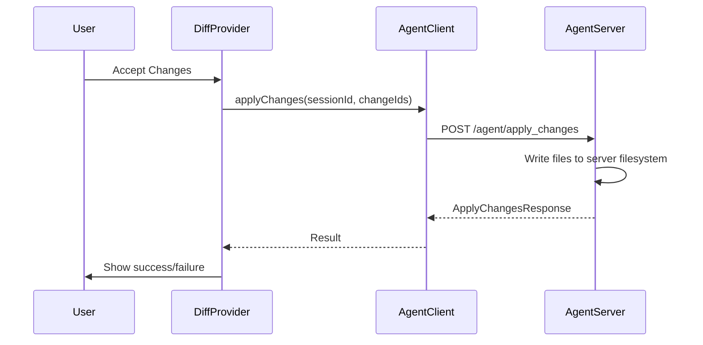
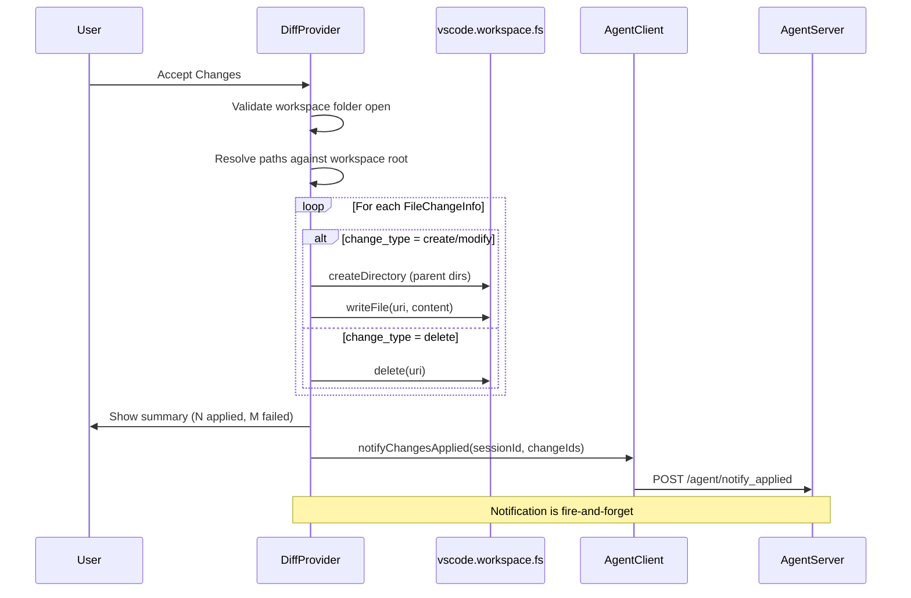

# Design Document: Client-Side File Writing

## Overview

This feature moves file writing from the agent server to the VSCode extension client. Currently, when a user accepts proposed changes, the `DiffProvider` calls `AgentClient.applyChanges()` which sends a POST request to the server's `/agent/apply_changes` endpoint. The server then writes files to disk using its `ToolSystem.filesystem`. This architecture breaks when the extension runs on a different machine (e.g., a Mac laptop) than the agent server (e.g., a remote Linux GPU box), because the server writes to its own local filesystem, not the developer's workspace.

The fix is straightforward: the `DiffProvider.acceptChanges()` method will write files locally using `vscode.workspace.fs` instead of delegating to the server. After local writes succeed, the extension optionally notifies the server so it can update session state. The server notification is fire-and-forget — local write success is what matters.

## Architecture

### Current Flow



### New Flow



### Design Decisions

1. **Local-first writes**: The extension writes files directly via `vscode.workspace.fs`. This works regardless of whether the server is local or remote. The server's `apply_changes` endpoint is no longer called from the extension.

2. **Fire-and-forget server notification**: After successful local writes, the extension sends a lightweight notification to the server. If this fails, it's logged but doesn't affect the user. This keeps session state roughly in sync without coupling correctness to server availability.

3. **Per-file error isolation**: Each file write is independent. If one fails, the rest still proceed. This matches the existing server-side behavior and gives the user maximum value from a partial success.

4. **Workspace folder validation**: Before any writes, the extension checks that a workspace folder is open. This prevents writes to unexpected locations and gives a clear error message.

## Components and Interfaces

### Modified: `DiffProvider` (vscode-extension/src/diffProvider.ts)

The `acceptChanges()` method is rewritten to write locally instead of calling the server.

New private methods:

```typescript
/**
 * Write a single file change to the local workspace filesystem.
 * Handles create, modify, and delete change types.
 */
private async applyChangeLocally(
    workspaceRoot: vscode.Uri,
    change: FileChangeInfo
): Promise<{ changeId: string; success: boolean; error?: string }>

/**
 * Ensure all parent directories exist for a given file URI.
 */
private async ensureParentDirectories(fileUri: vscode.Uri): Promise<void>

/**
 * Extract the writable content from a FileChangeInfo's diff field.
 * Returns the content as a Uint8Array suitable for vscode.workspace.fs.writeFile.
 */
private extractContent(change: FileChangeInfo): Uint8Array
```

Updated public method:

```typescript
/**
 * Accept all pending changes by writing them to the local filesystem.
 * Notifies the server afterward for session state tracking.
 */
public async acceptChanges(): Promise<void>
```

### Modified: `AgentClient` (vscode-extension/src/agentClient.ts)

New method for fire-and-forget notification:

```typescript
/**
 * Notify the server that changes were applied locally.
 * This is best-effort — failures are logged, not thrown.
 */
async notifyChangesApplied(
    sessionId: string,
    changeIds: string[]
): Promise<void>
```

New request/response types:

```typescript
export interface NotifyAppliedRequest {
    session_id: string;
    change_ids: string[];
}
```

### Modified: Server API (server/api.py)

New endpoint:

```python
@app.post("/agent/notify_applied")
async def notify_applied(request: NotifyAppliedRequest):
    """
    Receive notification that the client applied changes locally.
    Marks the corresponding FileChange objects as applied in session state.
    """
```

New Pydantic model:

```python
class NotifyAppliedRequest(BaseModel):
    session_id: str
    change_ids: list[str]
```

### Unchanged: `ProposedContentProvider`

No changes needed. It continues to serve proposed content for diff previews.

### Unchanged: `extension.ts`

The command registrations for `acceptChanges` and `rejectChanges` remain the same. The `DiffProvider` constructor signature is unchanged.

## Data Models

### `FileChangeInfo` (existing, unchanged)

```typescript
export interface FileChangeInfo {
    change_id: string;    // Unique identifier for this change
    file_path: string;    // Relative path from workspace root
    change_type: string;  // "create" | "modify" | "delete"
    diff: string;         // Full new file content for create/modify
}
```

### `WriteResult` (new, internal to DiffProvider)

```typescript
interface WriteResult {
    changeId: string;
    filePath: string;
    success: boolean;
    error?: string;
}
```

Used internally to track the outcome of each file write, enabling the summary message.

### `NotifyAppliedRequest` (new, AgentClient)

```typescript
export interface NotifyAppliedRequest {
    session_id: string;
    change_ids: string[];
}
```

### `NotifyAppliedRequest` (new, server-side Pydantic)

```python
class NotifyAppliedRequest(BaseModel):
    session_id: str
    change_ids: list[str]
```


## Correctness Properties

*A property is a characteristic or behavior that should hold true across all valid executions of a system — essentially, a formal statement about what the system should do. Properties serve as the bridge between human-readable specifications and machine-verifiable correctness guarantees.*

### Property 1: Local writes bypass server apply_changes

*For any* set of pending changes and any session, when `acceptChanges()` is called, `vscode.workspace.fs.writeFile` (or `delete`) should be called for each change, and `agentClient.applyChanges` should never be called.

**Validates: Requirements 1.1**

### Property 2: File paths resolve against workspace root

*For any* `FileChangeInfo` with a relative `file_path`, the URI passed to `vscode.workspace.fs.writeFile` or `delete` should equal `Uri.joinPath(workspaceRoot, file_path)`.

**Validates: Requirements 1.2, 5.2**

### Property 3: Create and modify writes use diff content

*For any* `FileChangeInfo` with `change_type` of "create" or "modify", `vscode.workspace.fs.writeFile` should be called with the resolved URI and the `diff` field encoded as a `Uint8Array`.

**Validates: Requirements 1.3, 1.4**

### Property 4: Delete removes the file

*For any* `FileChangeInfo` with `change_type` of "delete", `vscode.workspace.fs.delete` should be called with the resolved URI.

**Validates: Requirements 1.5**

### Property 5: Parent directories are created for nested paths

*For any* `FileChangeInfo` with a `file_path` containing directory separators, `vscode.workspace.fs.createDirectory` should be called with the parent directory URI before `writeFile` is called.

**Validates: Requirements 2.1**

### Property 6: Server is notified with applied change IDs

*For any* set of pending changes where at least one write succeeds, `notifyChangesApplied` should be called with the session ID and the list of successfully applied change IDs.

**Validates: Requirements 3.1**

### Property 7: Partial failures do not abort the batch

*For any* batch of N pending changes where K writes fail (0 < K < N), all N changes should still be attempted (i.e., the write function is called N times), and the remaining N-K should succeed.

**Validates: Requirements 4.2**

### Property 8: Summary message reflects actual counts

*For any* batch of pending changes with S successes and F failures, the displayed message should contain both the success count S and the failure count F.

**Validates: Requirements 4.3**

### Property 9: Content round-trip fidelity

*For any* valid `FileChangeInfo` with `change_type` "create" or "modify", the bytes passed to `vscode.workspace.fs.writeFile` should decode to a string identical to the `diff` field. That is, `new TextDecoder().decode(extractContent(change)) === change.diff`.

**Validates: Requirements 6.1, 6.2, 6.3**

### Property 10: Reject clears state without writing

*For any* set of pending changes, calling `rejectChanges()` should result in `getPendingChanges()` returning an empty array, status bar buttons being hidden, and zero calls to `vscode.workspace.fs.writeFile` or `delete`.

**Validates: Requirements 7.3**

### Property 11: Accept clears state after writing

*For any* set of pending changes, after `acceptChanges()` completes, `getPendingChanges()` should return an empty array and status bar buttons should be hidden.

**Validates: Requirements 7.4**

## Error Handling

### Workspace Validation Errors

- If no workspace folder is open when `acceptChanges()` is called, show an error message via `vscode.window.showErrorMessage` and return immediately without writing any files or notifying the server.

### Individual File Write Errors

- Each file write is wrapped in a try/catch. On failure, the error is captured in a `WriteResult` with `success: false` and the error message.
- The loop continues to the next change regardless of the failure.
- After all writes complete:
  - If all succeeded: show an info message with the count.
  - If some failed: show a warning message with success and failure counts, plus the file paths that failed.
  - If all failed: show an error message.

### Server Notification Errors

- The `notifyChangesApplied` call is wrapped in a try/catch inside `AgentClient`.
- On failure, the error is logged to the extension's output channel.
- The user is not shown any error — the local writes already succeeded.
- The method returns `void` and never throws.

### Directory Creation Errors

- If `createDirectory` fails (e.g., permission denied), the subsequent `writeFile` will also fail, and the error is captured in the per-file error handling.
- The `{ recursive: true }` option on `createDirectory` handles the case where some parent directories already exist.

## Testing Strategy

### Testing Framework

- **Unit tests**: Jest (already configured in `vscode-extension/jest.config.js`)
- **Property-based tests**: fast-check (already in `devDependencies`)
- **Mocking**: Jest mocks with the existing `__mocks__/vscode.ts` mock module

The vscode mock will need to be extended to include `vscode.workspace.fs` methods (`writeFile`, `delete`, `createDirectory`).

### Unit Tests

Unit tests cover specific examples, edge cases, and error conditions:

1. **Workspace validation**: Accept with no workspace folder open shows error and aborts.
2. **Server notification failure**: Notification throws, but acceptChanges still resolves and user sees success.
3. **All writes fail**: Error message is displayed (not info/warning).
4. **Single write failure in batch**: Failed file path and error reason appear in the message.
5. **Empty pending changes**: acceptChanges returns immediately without writing.
6. **Delete change type**: `vscode.workspace.fs.delete` is called, not `writeFile`.

### Property-Based Tests

Each property test uses fast-check with a minimum of 100 iterations and references its design property.

Property tests require custom arbitraries:

- `fileChangeInfoArb`: Generates random `FileChangeInfo` objects with valid `change_id`, `file_path` (relative, with random nesting depth), `change_type` (one of "create", "modify", "delete"), and `diff` (random string content).
- `pendingChangesArb`: Generates arrays of 1-10 `FileChangeInfo` objects.

Each property-based test file should be named `diffProvider.property.test.ts` and placed in `vscode-extension/src/__tests__/`.

Each test must be tagged with a comment:
```
// Feature: client-side-file-writing, Property {N}: {property_text}
```

### Test Configuration

- fast-check `numRuns`: 100 (minimum per property)
- Jest test environment: `node` (existing config)
- Mock `vscode.workspace.fs` methods added to `__mocks__/vscode.ts`
