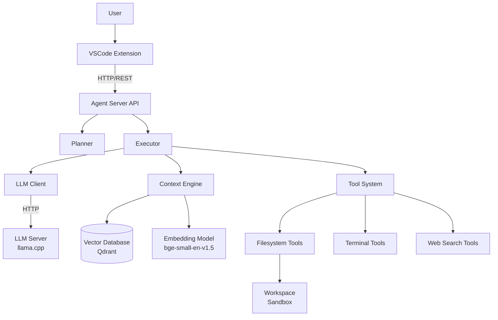
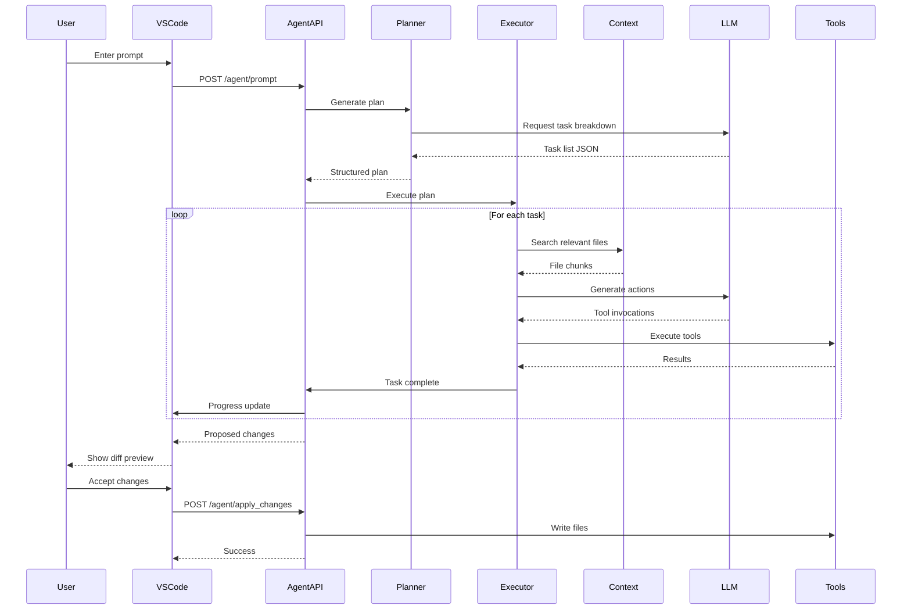

# Design Document: Local Offline Coding Agent

## Overview

This design specifies a fully self-hosted AI coding agent system that runs on a remote desktop machine (RTX 3080 10GB, 32GB RAM, i7 11th gen) and integrates with a custom VSCode extension. The system enables users to prompt an AI agent to generate, modify, or refactor entire codebases within the currently opened workspace.

### System Goals

- Provide a fully offline AI coding assistant with no internet dependency for core features
- Achieve responsive performance (25-40 tokens/sec, <10s single file generation, <60s project scaffolding)
- Maintain security through workspace sandboxing
- Enable semantic code understanding through repository indexing
- Support planning-based task decomposition for complex features

### Architecture Philosophy

The system follows a client-server architecture with clear separation of concerns:

1. **LLM Server**: Isolated inference engine exposing OpenAI-compatible API
2. **Agent Server**: Orchestration layer managing planning, execution, and tool usage
3. **VSCode Extension**: User interface and change management
4. **Context Engine**: Repository understanding and semantic search
5. **Tool System**: Sandboxed operations for filesystem, terminal, and web access


## Architecture

### System Components



### Component Responsibilities

#### LLM Server (llama.cpp)
- Loads Qwen2.5-Coder-7B-Instruct model in Q4_K_M GGUF quantization
- Exposes OpenAI-compatible HTTP API on port 8001
- Manages GPU memory and layer offloading for RTX 3080
- Provides 8192 token context window
- Targets 25-40 tokens/sec generation speed

#### Agent Server (FastAPI)
- Exposes REST API for VSCode extension communication
- Manages agent state and session lifecycle
- Coordinates planner and executor components
- Handles configuration loading and validation
- Implements error handling and logging

#### Planner
- Converts user prompts into structured task lists
- Calls LLM to generate task breakdown
- Produces JSON task format with dependencies
- Completes within 10 second target

#### Executor
- Processes tasks sequentially from plan
- Retrieves relevant context from Context Engine
- Calls LLM to generate actions for each task
- Parses LLM output for tool invocations
- Executes tools through Tool System
- Updates task state on completion
- Supports multi-file edits within single task

#### Context Engine
- Indexes workspace files on startup
- Chunks files into 512-token segments
- Generates embeddings using bge-small-en-v1.5
- Stores embeddings in Qdrant vector database
- Performs semantic search for task context
- Caches embeddings to avoid recomputation

#### Tool System
- Provides sandboxed filesystem operations
- Executes terminal commands with timeout
- Performs web search via DuckDuckGo (optional)
- Enforces workspace security boundaries
- Returns structured results to executor

#### VSCode Extension
- Provides chat interface for user interaction
- Sends prompts to Agent Server
- Displays task progress in real-time
- Shows diff previews for proposed changes
- Manages change acceptance/rejection workflow
- Applies accepted changes to workspace


### Communication Flow

#### User Prompt to Code Generation



### Data Flow

1. **User Input**: User types prompt in VSCode chat panel
2. **Planning Phase**: Agent Server calls LLM to decompose prompt into tasks
3. **Context Retrieval**: For each task, Context Engine performs semantic search
4. **Action Generation**: Executor calls LLM with task + context to generate actions
5. **Tool Execution**: Executor invokes tools (read/write files, run commands, etc.)
6. **Change Preview**: VSCode displays diffs for all proposed file changes
7. **Change Application**: User accepts/rejects changes, accepted changes are written


## Components and Interfaces

### Agent Server API (FastAPI)

#### Endpoints

**POST /agent/prompt**
```python
Request:
{
    "prompt": str,
    "workspace_path": str,
    "session_id": Optional[str]
}

Response:
{
    "session_id": str,
    "plan": {
        "tasks": [
            {
                "task_id": str,
                "description": str,
                "dependencies": List[str],
                "estimated_complexity": str  # "low", "medium", "high"
            }
        ]
    },
    "status": str  # "planning", "executing", "completed", "error"
}
```

**GET /agent/status/{session_id}**
```python
Response:
{
    "session_id": str,
    "status": str,
    "current_task": Optional[str],
    "completed_tasks": List[str],
    "pending_changes": [
        {
            "change_id": str,
            "file_path": str,
            "change_type": str,  # "create", "modify", "delete"
            "diff": str
        }
    ],
    "progress": float  # 0.0 to 1.0
}
```

**POST /agent/apply_changes**
```python
Request:
{
    "session_id": str,
    "change_ids": List[str]  # IDs of changes to apply
}

Response:
{
    "applied": List[str],
    "failed": List[str],
    "errors": Dict[str, str]
}
```

**POST /agent/cancel**
```python
Request:
{
    "session_id": str
}

Response:
{
    "status": str  # "cancelled"
}
```


### LLM Client Interface

```python
class LLMClient:
    def __init__(self, base_url: str, model: str, max_tokens: int):
        """Initialize client with OpenAI-compatible endpoint"""

    def complete(
        self,
        messages: List[Dict[str, str]],
        temperature: float = 0.2,
        max_tokens: int = 2048,
        stop: Optional[List[str]] = None
    ) -> str:
        """Generate completion from messages"""

    def stream_complete(
        self,
        messages: List[Dict[str, str]],
        temperature: float = 0.2,
        max_tokens: int = 2048
    ) -> Iterator[str]:
        """Stream completion tokens"""
```

### Planner Interface

```python
class Planner:
    def __init__(self, llm_client: LLMClient):
        """Initialize with LLM client"""

    def generate_plan(
        self,
        prompt: str,
        workspace_context: Dict[str, Any]
    ) -> Plan:
        """
        Generate structured task plan from user prompt.

        Args:
            prompt: User's request
            workspace_context: Repository structure and metadata

        Returns:
            Plan object with tasks, dependencies, and estimates
        """
```

### Executor Interface

```python
class Executor:
    def __init__(
        self,
        llm_client: LLMClient,
        tool_system: ToolSystem,
        context_engine: ContextEngine
    ):
        """Initialize with dependencies"""

    def execute_plan(
        self,
        plan: Plan,
        workspace_path: str
    ) -> ExecutionResult:
        """
        Execute plan tasks sequentially.

        Args:
            plan: Structured task plan
            workspace_path: Root directory for operations

        Returns:
            ExecutionResult with proposed changes and status
        """

    def execute_task(
        self,
        task: Task,
        workspace_path: str
    ) -> TaskResult:
        """Execute single task with context retrieval and LLM calls"""
```


### Tool System Interface

```python
class ToolSystem:
    def __init__(self, workspace_path: str, config: ToolConfig):
        """Initialize with workspace root and configuration"""

    def read_file(self, path: str) -> str:
        """Read file contents, path relative to workspace"""

    def write_file(self, path: str, contents: str) -> None:
        """Write file contents, creates parent directories if needed"""

    def create_file(self, path: str) -> None:
        """Create empty file"""

    def list_directory(self, path: str) -> List[str]:
        """List directory contents"""

    def search_files(self, query: str) -> List[str]:
        """Search for files matching query (glob pattern)"""

    def run_command(
        self,
        command: str,
        timeout: int = 60
    ) -> CommandResult:
        """Execute shell command with timeout"""

    def web_search(self, query: str) -> List[WebResult]:
        """Search web and scrape top results (if enabled)"""

    def validate_path(self, path: str) -> str:
        """Validate and resolve path within workspace sandbox"""
```

### Context Engine Interface

```python
class ContextEngine:
    def __init__(
        self,
        embedding_model_path: str,
        vector_db_config: Dict[str, Any]
    ):
        """Initialize with embedding model and vector database"""

    def index_workspace(
        self,
        workspace_path: str,
        file_patterns: List[str] = ["**/*.py", "**/*.js", "**/*.ts", ...]
    ) -> None:
        """
        Index all files in workspace.
        Chunks files, generates embeddings, stores in vector DB.
        """

    def search(
        self,
        query: str,
        top_k: int = 10,
        min_score: float = 0.7
    ) -> List[SearchResult]:
        """
        Semantic search for relevant code chunks.

        Returns:
            List of SearchResult with file_path, line_start, line_end,
            content, and similarity_score
        """

    def get_file_tree(self, workspace_path: str) -> Dict[str, Any]:
        """Get hierarchical file tree structure"""
```


### VSCode Extension Interface

```typescript
// Extension API
interface AgentExtension {
    // Chat panel management
    showChatPanel(): void;
    sendMessage(message: string): Promise<void>;

    // Agent communication
    sendPrompt(prompt: string): Promise<AgentResponse>;
    getStatus(sessionId: string): Promise<AgentStatus>;
    applyChanges(sessionId: string, changeIds: string[]): Promise<void>;
    cancelSession(sessionId: string): Promise<void>;

    // Change preview
    showDiffPreview(changes: FileChange[]): void;

    // Slash commands
    registerCommand(command: string, handler: CommandHandler): void;
}

// Data types
interface AgentResponse {
    sessionId: string;
    plan: Plan;
    status: string;
}

interface AgentStatus {
    sessionId: string;
    status: string;
    currentTask?: string;
    completedTasks: string[];
    pendingChanges: FileChange[];
    progress: number;
}

interface FileChange {
    changeId: string;
    filePath: string;
    changeType: 'create' | 'modify' | 'delete';
    diff: string;
}
```


## Data Models

### Plan and Task Models

```python
@dataclass
class Task:
    task_id: str
    description: str
    dependencies: List[str]
    estimated_complexity: str  # "low", "medium", "high"
    status: str = "pending"  # "pending", "in_progress", "completed", "failed"

@dataclass
class Plan:
    plan_id: str
    tasks: List[Task]
    created_at: datetime

    def get_next_task(self) -> Optional[Task]:
        """Get next task with satisfied dependencies"""
        for task in self.tasks:
            if task.status == "pending":
                deps_satisfied = all(
                    self.get_task(dep_id).status == "completed"
                    for dep_id in task.dependencies
                )
                if deps_satisfied:
                    return task
        return None

    def get_task(self, task_id: str) -> Optional[Task]:
        """Get task by ID"""
        return next((t for t in self.tasks if t.task_id == task_id), None)
```

### Execution State Models

```python
@dataclass
class FileChange:
    change_id: str
    file_path: str
    change_type: str  # "create", "modify", "delete"
    original_content: Optional[str]
    new_content: Optional[str]
    diff: str
    applied: bool = False

@dataclass
class TaskResult:
    task_id: str
    status: str  # "success", "failed"
    changes: List[FileChange]
    tool_calls: List[ToolCall]
    error: Optional[str] = None

@dataclass
class ExecutionResult:
    plan_id: str
    status: str  # "completed", "partial", "failed"
    completed_tasks: List[str]
    failed_tasks: List[str]
    all_changes: List[FileChange]
```


### Tool Models

```python
@dataclass
class ToolCall:
    tool_name: str
    arguments: Dict[str, Any]
    result: Optional[Any] = None
    error: Optional[str] = None

@dataclass
class CommandResult:
    exit_code: int
    stdout: str
    stderr: str
    timed_out: bool = False

@dataclass
class WebResult:
    title: str
    url: str
    summary: str
    content: str
```

### Context Models

```python
@dataclass
class SearchResult:
    file_path: str
    line_start: int
    line_end: int
    content: str
    similarity_score: float

@dataclass
class FileChunk:
    file_path: str
    chunk_id: str
    line_start: int
    line_end: int
    content: str
    embedding: Optional[np.ndarray] = None
```

### Session State

```python
@dataclass
class AgentSession:
    session_id: str
    workspace_path: str
    plan: Optional[Plan]
    execution_result: Optional[ExecutionResult]
    status: str  # "planning", "executing", "completed", "error", "cancelled"
    created_at: datetime
    updated_at: datetime
    error: Optional[str] = None
```


## Implementation Details

### LLM Server Setup (llama.cpp)

**Model Configuration:**
- Model: Qwen2.5-Coder-7B-Instruct
- Quantization: Q4_K_M GGUF format (~4.37GB)
- Context length: 8192 tokens
- GPU layers: Auto-detect for RTX 3080 (typically 32-35 layers)

**Server Launch Command:**
```bash
./llama-server \
    --model models/qwen2.5-coder-7b-instruct-q4_k_m.gguf \
    --ctx-size 8192 \
    --n-gpu-layers 35 \
    --port 8001 \
    --host 0.0.0.0 \
    --threads 6 \
    --batch-size 512 \
    --ubatch-size 256
```

**Performance Tuning:**
- Use `--n-gpu-layers` to maximize GPU utilization (monitor VRAM usage)
- Set `--threads` to physical cores minus 2 for system overhead
- Adjust `--batch-size` and `--ubatch-size` for throughput vs latency tradeoff
- Enable `--flash-attn` if supported for faster attention computation

**API Compatibility:**
The server exposes OpenAI-compatible endpoints:
- `POST /v1/chat/completions` - Chat completion
- `POST /v1/completions` - Text completion
- `GET /v1/models` - List available models


### Planning System Implementation

**Prompt Template for Planning:**
```
You are a coding agent planner. Break down the user's request into structured tasks.

User Request: {user_prompt}

Workspace Context:
{file_tree}

Generate a JSON plan with the following structure:
{
  "tasks": [
    {
      "task_id": "task_1",
      "description": "Clear description of what to do",
      "dependencies": [],
      "estimated_complexity": "low|medium|high"
    }
  ]
}

Guidelines:
- Create atomic tasks that can be completed independently
- Specify dependencies when tasks must be done in order
- Estimate complexity based on scope (low: 1 file, medium: 2-5 files, high: 6+ files)
- Include tasks for testing if appropriate
```

**Planning Algorithm:**
1. Retrieve workspace file tree from Context Engine
2. Construct planning prompt with user request and context
3. Call LLM with temperature=0.3 for more deterministic output
4. Parse JSON response into Plan object
5. Validate task structure (unique IDs, valid dependencies)
6. Return Plan or retry on parse failure (max 3 attempts)

**Timeout Handling:**
- Set 10 second timeout for LLM call
- If timeout occurs, return simple single-task plan as fallback
- Log timeout for monitoring


### Executor Implementation

**Task Execution Loop:**
```python
def execute_plan(self, plan: Plan, workspace_path: str) -> ExecutionResult:
    all_changes = []
    completed = []
    failed = []

    while task := plan.get_next_task():
        task.status = "in_progress"

        try:
            result = self.execute_task(task, workspace_path)

            if result.status == "success":
                task.status = "completed"
                completed.append(task.task_id)
                all_changes.extend(result.changes)
            else:
                task.status = "failed"
                failed.append(task.task_id)
                # Continue with other tasks unless critical

        except Exception as e:
            task.status = "failed"
            failed.append(task.task_id)
            logger.error(f"Task {task.task_id} failed: {e}")

    status = "completed" if not failed else "partial" if completed else "failed"
    return ExecutionResult(plan.plan_id, status, completed, failed, all_changes)
```

**Task Execution Steps:**
1. **Context Retrieval**: Search for relevant files using task description
2. **Prompt Construction**: Build structured prompt with task, context, and tools
3. **LLM Call**: Generate actions with streaming for responsiveness
4. **Output Parsing**: Extract tool calls and file operations from response
5. **Tool Execution**: Execute each tool call and collect results
6. **Change Tracking**: Record all file changes for preview
7. **Result Return**: Package changes and status


### LLM Prompt Structure for Execution

```
You are a coding agent executing a task. You have access to tools for file operations.

GOAL: {user_original_prompt}

CURRENT TASK: {task_description}

WORKSPACE STRUCTURE:
{file_tree}

RELEVANT CODE CONTEXT:
{semantic_search_results}

AVAILABLE TOOLS:
- read_file(path: str) -> str
- write_file(path: str, contents: str) -> None
- create_file(path: str) -> None
- list_directory(path: str) -> List[str]
- search_files(query: str) -> List[str]
- run_command(command: str) -> CommandResult
- web_search(query: str) -> List[WebResult]  # if enabled

OUTPUT FORMAT:
Use the following format to invoke tools:

WRITE_FILE: path/to/file.py
```python
# file contents here
```

PATCH_FILE: path/to/file.py
```diff
--- original
+++ modified
@@ -1,3 +1,3 @@
-old line
+new line
```

TOOL_CALL: tool_name
{
  "arg1": "value1",
  "arg2": "value2"
}

REASONING: Explain your approach before taking actions.

Begin:
```

**Parsing Strategy:**
- Use regex patterns to extract WRITE_FILE, PATCH_FILE, and TOOL_CALL blocks
- For WRITE_FILE: Extract path and code block contents
- For PATCH_FILE: Extract path and apply unified diff
- For TOOL_CALL: Parse JSON arguments and invoke tool
- Handle multiple operations in single response
- Retry with clarification prompt if parsing fails


### Tool System Implementation

#### Filesystem Tools

**Path Validation (Security Critical):**
```python
def validate_path(self, path: str) -> str:
    """
    Validate path is within workspace sandbox.
    Raises SecurityError if path escapes workspace.
    """
    # Resolve to absolute path
    abs_path = os.path.abspath(os.path.join(self.workspace_path, path))

    # Check if path starts with workspace root
    if not abs_path.startswith(os.path.abspath(self.workspace_path)):
        raise SecurityError(f"Path {path} escapes workspace boundary")

    # Reject paths with parent directory traversal
    if ".." in Path(path).parts:
        raise SecurityError(f"Path {path} contains parent directory reference")

    return abs_path
```

**File Operations:**
- `read_file`: Validate path, read with UTF-8 encoding, handle binary files gracefully
- `write_file`: Validate path, create parent directories, write atomically (temp file + rename)
- `create_file`: Validate path, create empty file with parent directories
- `list_directory`: Validate path, return relative paths, exclude hidden files by default
- `search_files`: Use glob patterns, validate all results are in workspace


#### Terminal Tool

**Command Execution:**
```python
def run_command(self, command: str, timeout: int = 60) -> CommandResult:
    """
    Execute command in workspace with security restrictions.
    """
    # Security: Reject dangerous shell operators
    dangerous_patterns = [';', '&&', '||', '|', '>', '<', '`', '$()']
    if any(pattern in command for pattern in dangerous_patterns):
        raise SecurityError(f"Command contains forbidden operator")

    # Execute in subprocess
    try:
        result = subprocess.run(
            command,
            shell=True,
            cwd=self.workspace_path,
            capture_output=True,
            text=True,
            timeout=timeout
        )
        return CommandResult(
            exit_code=result.returncode,
            stdout=result.stdout,
            stderr=result.stderr,
            timed_out=False
        )
    except subprocess.TimeoutExpired:
        return CommandResult(
            exit_code=-1,
            stdout="",
            stderr=f"Command timed out after {timeout}s",
            timed_out=True
        )
```

**Allowed Commands:**
- Package managers: `npm`, `pip`, `cargo`, `go get`
- Build tools: `make`, `cmake`, `gradle`, `mvn`
- Test runners: `pytest`, `jest`, `cargo test`
- Linters: `eslint`, `pylint`, `rustfmt`

**Blocked Commands:**
- System modification: `rm -rf`, `sudo`, `chmod`
- Network tools: `curl`, `wget`, `ssh`
- Process management: `kill`, `pkill`


#### Web Search Tool

**Implementation (Optional Feature):**
```python
def web_search(self, query: str) -> List[WebResult]:
    """
    Search DuckDuckGo and scrape top 3 results.
    Returns empty list on failure (graceful degradation).
    """
    if not self.config.web_search_enabled:
        return []

    try:
        # Use duckduckgo-search library
        results = DDGS().text(query, max_results=3)

        web_results = []
        for result in results:
            # Scrape page content
            try:
                response = requests.get(result['href'], timeout=5)
                soup = BeautifulSoup(response.text, 'html.parser')

                # Extract main content
                content = soup.get_text(separator='\n', strip=True)
                summary = content[:500]  # First 500 chars

                web_results.append(WebResult(
                    title=result['title'],
                    url=result['href'],
                    summary=summary,
                    content=content[:5000]  # Limit to 5000 chars
                ))
            except Exception as e:
                logger.warning(f"Failed to scrape {result['href']}: {e}")
                continue

        return web_results

    except Exception as e:
        logger.error(f"Web search failed: {e}")
        return []  # Graceful failure
```

**Rate Limiting:**
- Max 5 searches per session
- 2 second delay between searches
- Cache results for 1 hour


### Context Engine Implementation

#### Repository Indexing

**Indexing Pipeline:**
```python
def index_workspace(self, workspace_path: str, file_patterns: List[str]) -> None:
    """
    Index all matching files in workspace.
    """
    # 1. Discover files
    files = []
    for pattern in file_patterns:
        files.extend(glob.glob(os.path.join(workspace_path, pattern), recursive=True))

    # 2. Filter out large files and binaries
    files = [f for f in files if os.path.getsize(f) < 1_000_000]  # Max 1MB

    # 3. Chunk files
    chunks = []
    for file_path in files:
        chunks.extend(self._chunk_file(file_path))

    # 4. Generate embeddings in batches
    batch_size = 32
    for i in range(0, len(chunks), batch_size):
        batch = chunks[i:i+batch_size]
        embeddings = self._generate_embeddings([c.content for c in batch])

        for chunk, embedding in zip(batch, embeddings):
            chunk.embedding = embedding

    # 5. Store in vector database
    self._store_chunks(chunks)

    logger.info(f"Indexed {len(files)} files, {len(chunks)} chunks")
```

**File Chunking Strategy:**
- Split on function/class boundaries (use AST parsing for Python/JS/TS)
- Fallback to fixed 512-token chunks with 50-token overlap
- Preserve context by including file path and surrounding structure in metadata
- Store line numbers for precise retrieval


#### Embedding Generation

**Model: bge-small-en-v1.5**
- Dimensions: 384
- Max sequence length: 512 tokens
- Fast inference: ~100 sequences/sec on CPU

**Implementation:**
```python
from sentence_transformers import SentenceTransformer

class EmbeddingModel:
    def __init__(self, model_path: str):
        self.model = SentenceTransformer(model_path)

    def encode(self, texts: List[str]) -> np.ndarray:
        """Generate embeddings for batch of texts"""
        return self.model.encode(
            texts,
            batch_size=32,
            show_progress_bar=False,
            normalize_embeddings=True  # For cosine similarity
        )
```

**Caching Strategy:**
- Store embeddings in Qdrant with file hash as metadata
- On re-index, check if file hash changed
- Skip embedding generation for unchanged files
- Reduces re-indexing time from 5 minutes to ~30 seconds


#### Semantic Search

**Vector Database: Qdrant**
- In-memory mode for fast startup (persistent mode optional)
- Collection per workspace
- HNSW index for fast approximate nearest neighbor search

**Search Implementation:**
```python
def search(self, query: str, top_k: int = 10, min_score: float = 0.7) -> List[SearchResult]:
    """
    Semantic search for relevant code chunks.
    """
    # Generate query embedding
    query_embedding = self.embedding_model.encode([query])[0]

    # Search vector database
    search_result = self.vector_db.search(
        collection_name=self.collection_name,
        query_vector=query_embedding,
        limit=top_k,
        score_threshold=min_score
    )

    # Convert to SearchResult objects
    results = []
    for hit in search_result:
        results.append(SearchResult(
            file_path=hit.payload['file_path'],
            line_start=hit.payload['line_start'],
            line_end=hit.payload['line_end'],
            content=hit.payload['content'],
            similarity_score=hit.score
        ))

    return results
```

**Search Optimization:**
- Pre-filter by file type if task mentions specific languages
- Boost scores for recently modified files
- De-duplicate results from same file (keep highest scoring chunk)
- Return max 10 chunks to stay within context window


### VSCode Extension Implementation

#### Extension Architecture

**Components:**
- `extension.ts`: Main entry point, registers commands and providers
- `chatPanel.ts`: Webview panel for chat interface
- `agentClient.ts`: HTTP client for Agent Server communication
- `diffProvider.ts`: Custom diff view for change preview
- `statusBar.ts`: Status bar item showing agent state

**Activation:**
```typescript
export function activate(context: vscode.ExtensionContext) {
    // Initialize agent client
    const agentClient = new AgentClient(config.agentServerUrl);

    // Register chat panel
    const chatPanel = new ChatPanel(context.extensionUri, agentClient);

    // Register commands
    context.subscriptions.push(
        vscode.commands.registerCommand('agent.openChat', () => {
            chatPanel.show();
        }),
        vscode.commands.registerCommand('agent.build', () => {
            chatPanel.sendSlashCommand('/agent build');
        }),
        // ... other commands
    );

    // Register status bar
    const statusBar = new AgentStatusBar(agentClient);
    context.subscriptions.push(statusBar);
}
```


#### Chat Panel Implementation

**Webview UI:**
- React-based chat interface
- Message history with user/agent distinction
- Typing indicators during LLM generation
- Progress bars for task execution
- Inline code blocks with syntax highlighting

**Message Flow:**
```typescript
class ChatPanel {
    async sendMessage(message: string) {
        // Add user message to UI
        this.addMessage({ role: 'user', content: message });

        // Show typing indicator
        this.showTypingIndicator();

        try {
            // Send to agent server
            const response = await this.agentClient.sendPrompt(
                message,
                vscode.workspace.workspaceFolders[0].uri.fsPath
            );

            // Store session ID
            this.sessionId = response.sessionId;

            // Display plan
            this.displayPlan(response.plan);

            // Poll for status updates
            this.startStatusPolling(response.sessionId);

        } catch (error) {
            this.addMessage({
                role: 'error',
                content: `Failed to send prompt: ${error.message}`
            });
        } finally {
            this.hideTypingIndicator();
        }
    }

    private startStatusPolling(sessionId: string) {
        this.pollingInterval = setInterval(async () => {
            const status = await this.agentClient.getStatus(sessionId);
            this.updateProgress(status);

            if (status.status === 'completed') {
                clearInterval(this.pollingInterval);
                this.showChanges(status.pendingChanges);
            }
        }, 1000);  // Poll every second
    }
}
```


#### Change Preview and Application

**Diff View:**
```typescript
class DiffProvider {
    async showChanges(changes: FileChange[]) {
        for (const change of changes) {
            // Create temporary file with new content
            const tempUri = await this.createTempFile(change.newContent);
            const originalUri = vscode.Uri.file(change.filePath);

            // Show diff editor
            await vscode.commands.executeCommand(
                'vscode.diff',
                originalUri,
                tempUri,
                `${change.filePath} (Proposed Changes)`
            );

            // Add accept/reject buttons
            this.showChangeActions(change);
        }
    }

    private showChangeActions(change: FileChange) {
        const acceptButton = vscode.window.createStatusBarItem(
            vscode.StatusBarAlignment.Right,
            100
        );
        acceptButton.text = '$(check) Accept';
        acceptButton.command = {
            command: 'agent.acceptChange',
            arguments: [change.changeId]
        };
        acceptButton.show();

        // Similar for reject button
    }
}
```

**Change Application:**
```typescript
async acceptChange(changeId: string) {
    try {
        await this.agentClient.applyChanges(this.sessionId, [changeId]);

        // Refresh file in editor
        const change = this.pendingChanges.get(changeId);
        const doc = await vscode.workspace.openTextDocument(change.filePath);
        await doc.save();

        vscode.window.showInformationMessage('Change applied successfully');
    } catch (error) {
        vscode.window.showErrorMessage(`Failed to apply change: ${error.message}`);
    }
}
```


#### Slash Commands

**Command Registration:**
```typescript
const slashCommands = {
    '/agent build': 'Create a new project from scratch',
    '/agent implement': 'Implement a specific feature',
    '/agent refactor': 'Refactor existing code',
    '/agent explain': 'Explain code in the workspace',
    '/agent test': 'Generate tests for code',
    '/agent fix': 'Fix errors or bugs',
    '/agent docs': 'Generate documentation'
};

class ChatPanel {
    private handleSlashCommand(command: string, args: string) {
        const prompts = {
            '/agent build': `Create a new ${args} project with best practices`,
            '/agent implement': `Implement the following feature: ${args}`,
            '/agent refactor': `Refactor the code to ${args}`,
            '/agent explain': `Explain the code related to: ${args}`,
            '/agent test': `Generate comprehensive tests for: ${args}`,
            '/agent fix': `Fix the following issue: ${args}`,
            '/agent docs': `Generate documentation for: ${args}`
        };

        const prompt = prompts[command];
        if (prompt) {
            this.sendMessage(prompt);
        }
    }
}
```

**Auto-completion:**
- Register completion provider for slash commands
- Show command descriptions in completion list
- Support tab completion for command arguments


## Configuration Management

### Configuration File Structure

**config.yaml:**
```yaml
# LLM Server Configuration
llm:
  base_url: "http://localhost:8001/v1"
  model: "qwen2.5-coder-7b-instruct"
  max_tokens: 2048
  temperature: 0.2
  context_window: 8192

# Agent Server Configuration
agent:
  host: "0.0.0.0"
  port: 8000
  log_level: "INFO"
  log_file: "logs/agent.log"
  max_log_size_mb: 100

# Context Engine Configuration
context:
  embedding_model_path: "models/bge-small-en-v1.5"
  vector_db:
    type: "qdrant"
    host: "localhost"
    port: 6333
    collection_prefix: "workspace"
    in_memory: true
  chunk_size: 512
  chunk_overlap: 50
  file_patterns:
    - "**/*.py"
    - "**/*.js"
    - "**/*.ts"
    - "**/*.tsx"
    - "**/*.java"
    - "**/*.cpp"
    - "**/*.c"
    - "**/*.h"
    - "**/*.go"
    - "**/*.rs"
    - "**/*.md"
  exclude_patterns:
    - "**/node_modules/**"
    - "**/venv/**"
    - "**/.git/**"
    - "**/dist/**"
    - "**/build/**"

# Tool Configuration
tools:
  web_search:
    enabled: false
    max_results: 3
    timeout: 5
  terminal:
    enabled: true
    timeout: 60
    allowed_commands:
      - "npm"
      - "pip"
      - "pytest"
      - "jest"
      - "cargo"
      - "go"
      - "make"
  filesystem:
    max_file_size_mb: 10

# Performance Configuration
performance:
  max_concurrent_tasks: 1
  streaming_enabled: true
  cache_embeddings: true
```


### Configuration Loading

```python
from dataclasses import dataclass
from typing import Dict, List, Optional
import yaml

@dataclass
class LLMConfig:
    base_url: str
    model: str
    max_tokens: int
    temperature: float
    context_window: int

@dataclass
class ContextConfig:
    embedding_model_path: str
    vector_db: Dict[str, Any]
    chunk_size: int
    chunk_overlap: int
    file_patterns: List[str]
    exclude_patterns: List[str]

@dataclass
class ToolConfig:
    web_search_enabled: bool
    terminal_enabled: bool
    terminal_timeout: int
    allowed_commands: List[str]
    max_file_size_mb: int

@dataclass
class Config:
    llm: LLMConfig
    context: ContextConfig
    tools: ToolConfig
    # ... other config sections

    @classmethod
    def load(cls, config_path: str = "config.yaml") -> "Config":
        """Load configuration from YAML file"""
        with open(config_path) as f:
            data = yaml.safe_load(f)

        return cls(
            llm=LLMConfig(**data['llm']),
            context=ContextConfig(**data['context']),
            tools=ToolConfig(**data['tools']),
            # ... other sections
        )
```

**Environment Variable Overrides:**
- Support `AGENT_LLM_BASE_URL`, `AGENT_CONTEXT_EMBEDDING_MODEL_PATH`, etc.
- Environment variables take precedence over config file
- Useful for deployment and testing


## Error Handling

### Error Categories

1. **LLM Server Errors**
   - Connection refused: LLM server not running
   - Timeout: Generation taking too long
   - Invalid response: Malformed JSON or unexpected format

2. **Tool Execution Errors**
   - Security violations: Path escapes workspace
   - File not found: Invalid file path
   - Permission denied: Insufficient permissions
   - Command timeout: Terminal command exceeded limit

3. **Context Engine Errors**
   - Indexing failure: Unable to read files
   - Embedding generation failure: Model not loaded
   - Vector DB connection failure: Qdrant not available

4. **Parsing Errors**
   - Invalid LLM output: Cannot extract tool calls
   - Malformed JSON: Plan or response not parseable

### Error Handling Strategy

**Graceful Degradation:**
```python
class Executor:
    def execute_task(self, task: Task, workspace_path: str) -> TaskResult:
        try:
            # Attempt context retrieval
            context = self.context_engine.search(task.description)
        except Exception as e:
            logger.warning(f"Context search failed: {e}")
            context = []  # Continue without context

        try:
            # Attempt LLM call
            response = self.llm_client.complete(messages)
        except TimeoutError:
            logger.error("LLM timeout, retrying with shorter context")
            # Retry with reduced context
            response = self.llm_client.complete(messages_short)
        except ConnectionError:
            logger.error("LLM server unreachable")
            return TaskResult(
                task_id=task.task_id,
                status="failed",
                error="LLM server unavailable"
            )

        # Continue with response processing...
```


### Retry Logic

**Exponential Backoff:**
```python
def retry_with_backoff(func, max_attempts=3, base_delay=1.0):
    """Retry function with exponential backoff"""
    for attempt in range(max_attempts):
        try:
            return func()
        except Exception as e:
            if attempt == max_attempts - 1:
                raise
            delay = base_delay * (2 ** attempt)
            logger.warning(f"Attempt {attempt + 1} failed: {e}. Retrying in {delay}s")
            time.sleep(delay)
```

**Retry Policies:**
- LLM calls: 3 attempts with exponential backoff
- Tool execution: 2 attempts for transient errors (network, file locks)
- Parsing: 2 attempts with clarification prompt
- Context search: 1 attempt (fail gracefully)

### Logging Strategy

**Log Levels:**
- `DEBUG`: Detailed execution flow, LLM prompts/responses
- `INFO`: Task start/completion, major operations
- `WARNING`: Recoverable errors, degraded functionality
- `ERROR`: Failed operations, unrecoverable errors
- `CRITICAL`: System-level failures

**Log Format:**
```
[2024-01-15 10:30:45] [INFO] [executor] Starting task task_1: Implement user authentication
[2024-01-15 10:30:46] [DEBUG] [context] Searching for relevant files: "authentication"
[2024-01-15 10:30:46] [DEBUG] [context] Found 5 relevant chunks
[2024-01-15 10:30:47] [DEBUG] [llm] Calling LLM with 3500 tokens context
[2024-01-15 10:30:52] [INFO] [llm] Generated response in 5.2s
[2024-01-15 10:30:52] [DEBUG] [executor] Parsed 2 file operations
[2024-01-15 10:30:52] [INFO] [tools] Writing file: src/auth.py
[2024-01-15 10:30:52] [INFO] [executor] Task task_1 completed successfully
```

**Rotating Log Files:**
- Max size: 100MB per file
- Keep last 5 files
- Compress old logs


## Performance Optimization

### LLM Inference Optimization

**Context Window Management:**
- Prioritize most relevant context (highest similarity scores)
- Truncate file contents to essential parts
- Use file summaries for less relevant files
- Target 3000-4000 tokens for context (leave room for generation)

**Prompt Caching:**
- Cache common prompt templates
- Reuse system prompts across calls
- Minimize redundant context in multi-turn conversations

**Streaming:**
- Stream LLM responses token-by-token
- Display partial results in VSCode immediately
- Improves perceived responsiveness

### Context Engine Optimization

**Embedding Cache:**
```python
class EmbeddingCache:
    def __init__(self, cache_dir: str):
        self.cache_dir = cache_dir
        self.cache = {}  # file_path -> (hash, embedding)

    def get_or_compute(self, file_path: str, content: str) -> np.ndarray:
        """Get cached embedding or compute new one"""
        content_hash = hashlib.sha256(content.encode()).hexdigest()

        if file_path in self.cache:
            cached_hash, embedding = self.cache[file_path]
            if cached_hash == content_hash:
                return embedding

        # Compute new embedding
        embedding = self.model.encode([content])[0]
        self.cache[file_path] = (content_hash, embedding)

        return embedding
```

**Incremental Indexing:**
- Watch for file changes using filesystem events
- Re-index only modified files
- Update vector DB incrementally
- Reduces re-indexing from 5 minutes to seconds


### Memory Management

**GPU Memory (RTX 3080 10GB):**
- LLM model: ~4.5GB (Q4_K_M quantization)
- KV cache: ~2GB (8192 context)
- Remaining: ~3.5GB for other operations
- Monitor VRAM usage and adjust `--n-gpu-layers` if needed

**System Memory (32GB RAM):**
- LLM server: ~6GB
- Agent server: ~2GB
- Embedding model: ~500MB
- Vector DB: ~1GB (for 1000 files)
- Remaining: ~22GB for OS and other applications

**Memory Optimization:**
- Use memory-mapped files for large embeddings
- Limit concurrent LLM requests to 1
- Clear KV cache between sessions if needed
- Use Qdrant in-memory mode for speed (persistent mode for large repos)

### Disk I/O Optimization

**File Reading:**
- Use buffered I/O for large files
- Read files in parallel during indexing
- Cache frequently accessed files in memory

**File Writing:**
- Batch file writes when possible
- Use atomic writes (temp file + rename)
- Avoid unnecessary file reads before writes

### Network Optimization

**HTTP Communication:**
- Use connection pooling for LLM client
- Enable HTTP keep-alive
- Compress large payloads (gzip)
- Use WebSocket for real-time updates (future enhancement)


## Correctness Properties

*A property is a characteristic or behavior that should hold true across all valid executions of a system—essentially, a formal statement about what the system should do. Properties serve as the bridge between human-readable specifications and machine-verifiable correctness guarantees.*

### Property Reflection

After analyzing all acceptance criteria, I identified the following redundancies and consolidations:

- **Prompt construction properties (11.1-11.6)**: These six separate properties about including different elements in prompts can be consolidated into one comprehensive property about prompt completeness
- **LLM output parsing properties (12.1-12.3)**: These three properties about parsing different directive types can be consolidated into one property about parsing all directive types
- **Extraction properties (12.4-12.5)**: These are specific cases of the parsing properties and are subsumed by the general parsing property
- **Filesystem tool existence (5.1-5.5)**: These are all examples of API existence, not properties that need separate validation
- **Configuration structure (16.2-16.6)**: These are all examples of required config fields, can be consolidated into one property
- **Repository structure (18.1-18.8)**: These are all examples of required directories/files, not properties
- **Search result structure properties (8.2-8.3)**: Property 8.3 about result structure subsumes the structural aspect of 8.2
- **Command result structure (10.3-10.4)**: Property 10.4 about return value structure subsumes 10.3 about capture

The following properties provide unique validation value and will be included:


### Property 1: Context Window Support

*For any* valid prompt up to 8192 tokens, the LLM server should accept and process the request without truncation errors.

**Validates: Requirements 1.3**

### Property 2: Session State Persistence

*For any* sequence of requests within a session, the agent server should maintain consistent state across all requests, such that querying the session returns the accumulated state from all previous operations.

**Validates: Requirements 2.5**

### Property 3: Plan Structure Validity

*For any* user prompt, the generated plan should be valid JSON containing a tasks array where each task has the required fields: task_id, description, dependencies, and estimated_complexity.

**Validates: Requirements 3.1, 3.2**

### Property 4: Plan Non-Empty

*For any* user prompt, the generated plan should contain at least one task.

**Validates: Requirements 3.4**

### Property 5: Task Execution Completeness

*For any* plan with N tasks where all dependencies are satisfiable, the executor should process all N tasks (either completing or failing each one).

**Validates: Requirements 4.1**

### Property 6: Tool Execution on Invocation

*For any* LLM response containing tool invocation directives, the executor should execute each specified tool and record the results.

**Validates: Requirements 4.4**

### Property 7: Task Status Update

*For any* task that completes successfully, the task status should be updated to "completed" in the plan state.

**Validates: Requirements 4.5**

### Property 8: Path Resolution Consistency

*For any* relative path provided to filesystem functions, the resolved absolute path should be within the workspace directory and consistent across multiple resolutions of the same relative path.

**Validates: Requirements 5.6**


### Property 9: Sandbox Boundary Enforcement

*For any* path that resolves to a location outside the workspace directory (including paths with ".." that escape, or absolute paths outside workspace), the filesystem tool should raise a security error and prevent the operation.

**Validates: Requirements 6.1, 6.2, 6.3**

### Property 10: Chunk Size Constraint

*For any* file indexed by the context engine, all generated chunks should have a token count less than or equal to 512 tokens.

**Validates: Requirements 7.2**

### Property 11: Embedding Generation Completeness

*For any* set of chunks generated during indexing, each chunk should have a corresponding embedding vector stored in the vector database.

**Validates: Requirements 7.3**

### Property 12: Embedding Metadata Completeness

*For any* embedding stored in the vector database, the metadata should include file_path, line_start, and line_end fields.

**Validates: Requirements 7.4**

### Property 13: Search Result Filtering

*For any* semantic search query, all returned results should have similarity scores greater than or equal to 0.7, and the result count should not exceed 10.

**Validates: Requirements 8.2**

### Property 14: Search Result Structure

*For any* search result returned by the context engine, the result should include file_path, line_start, line_end, content, and similarity_score fields.

**Validates: Requirements 8.3**

### Property 15: Web Search Result Structure

*For any* successful web search operation, each result should include title, url, summary, and content fields.

**Validates: Requirements 9.4**

### Property 16: Web Search Graceful Failure

*For any* web search operation that encounters an error, the function should return an empty list without raising an exception.

**Validates: Requirements 9.5**


### Property 17: Command Working Directory

*For any* command executed via run_command, the working directory should be set to the workspace path, verifiable by commands that output their current working directory.

**Validates: Requirements 10.2**

### Property 18: Command Output Capture

*For any* command executed via run_command, the returned CommandResult should include exit_code, stdout, and stderr fields with the actual output from the command execution.

**Validates: Requirements 10.3, 10.4**

### Property 19: Dangerous Command Rejection

*For any* command string containing shell operators (;, &&, ||, |, >, <, `, $()), the run_command function should reject the command with a security error before execution.

**Validates: Requirements 10.6**

### Property 20: Prompt Completeness

*For any* task execution, the prompt sent to the LLM should include all required elements: user goal, current plan, task description, relevant file contents, repository tree structure, and available tool descriptions.

**Validates: Requirements 11.1, 11.2, 11.3, 11.4, 11.5, 11.6**

### Property 21: Directive Parsing Completeness

*For any* LLM response containing WRITE_FILE, PATCH_FILE, or TOOL_CALL directives, the executor should successfully parse and extract all directives with their associated data (file paths, contents, diffs, or tool arguments).

**Validates: Requirements 12.1, 12.2, 12.3, 12.4, 12.5**

### Property 22: Slash Command Recognition

*For any* message starting with a recognized slash command (/agent build, /agent implement, /agent refactor, /agent explain), the VSCode extension should parse and handle the command appropriately.

**Validates: Requirements 13.5**

### Property 23: Embedding Cache Effectiveness

*For any* file that is indexed twice without modification (same content hash), the embedding should be retrieved from cache rather than recomputed, verifiable by checking that the embedding model is not invoked for the second indexing.

**Validates: Requirements 15.4**


### Property 24: Error Logging Completeness

*For any* error encountered by any component, the log entry should include a timestamp, error message, and stack trace.

**Validates: Requirements 17.1**


## Testing Strategy

### Dual Testing Approach

The system will employ both unit testing and property-based testing to ensure comprehensive coverage:

**Unit Tests** focus on:
- Specific examples and edge cases
- Integration points between components
- Error conditions and failure modes
- Configuration loading and validation
- Repository structure verification
- Mock-based testing of external dependencies (LLM, vector DB)

**Property-Based Tests** focus on:
- Universal properties that hold for all inputs
- Security boundary enforcement with randomized paths
- Prompt construction completeness with varied inputs
- Parsing robustness with diverse LLM outputs
- State consistency across random operation sequences

Together, these approaches provide complementary coverage: unit tests catch concrete bugs in specific scenarios, while property tests verify general correctness across a wide input space.

### Property-Based Testing Configuration

**Framework Selection:**
- Python: Use `hypothesis` library for property-based testing
- TypeScript: Use `fast-check` library for VSCode extension tests

**Test Configuration:**
- Minimum 100 iterations per property test (due to randomization)
- Each property test must reference its design document property
- Tag format: `# Feature: local-offline-coding-agent, Property {number}: {property_text}`

**Example Property Test:**
```python
from hypothesis import given, strategies as st
import pytest

# Feature: local-offline-coding-agent, Property 9: Sandbox Boundary Enforcement
@given(st.text(min_size=1))
def test_sandbox_boundary_enforcement(path_component):
    """
    For any path that resolves outside workspace, filesystem tool
    should raise security error.
    """
    tool_system = ToolSystem(workspace_path="/tmp/workspace")

    # Try to escape workspace
    malicious_paths = [
        f"../{path_component}",
        f"../../{path_component}",
        f"/etc/{path_component}",
        f"/tmp/other/{path_component}"
    ]

    for path in malicious_paths:
        if not path.startswith("/tmp/workspace"):
            with pytest.raises(SecurityError):
                tool_system.read_file(path)
```


### Unit Test Organization

**Test Structure:**
```
tests/
├── unit/
│   ├── test_planner.py
│   ├── test_executor.py
│   ├── test_llm_client.py
│   ├── test_filesystem_tools.py
│   ├── test_terminal_tools.py
│   ├── test_web_tools.py
│   ├── test_context_engine.py
│   ├── test_embeddings.py
│   └── test_config.py
├── integration/
│   ├── test_planning_workflow.py
│   ├── test_execution_workflow.py
│   ├── test_indexing_workflow.py
│   └── test_api_endpoints.py
├── property/
│   ├── test_sandbox_properties.py
│   ├── test_parsing_properties.py
│   ├── test_state_properties.py
│   └── test_prompt_properties.py
├── e2e/
│   ├── test_full_workflow.py
│   └── test_vscode_integration.py
└── fixtures/
    ├── sample_workspaces/
    ├── mock_llm_responses/
    └── test_configs/
```

**Key Test Scenarios:**

1. **Planner Tests**
   - Valid plan generation from various prompts
   - Task dependency validation
   - JSON parsing error handling
   - Timeout handling with fallback

2. **Executor Tests**
   - Task execution loop with dependencies
   - Context retrieval integration
   - Tool invocation from LLM responses
   - Multi-file edit handling
   - Error recovery and continuation

3. **Filesystem Tool Tests**
   - Path validation and resolution
   - Sandbox boundary enforcement (property tests)
   - File read/write operations
   - Directory listing and search
   - Atomic write operations

4. **Terminal Tool Tests**
   - Command execution with output capture
   - Working directory verification
   - Timeout enforcement
   - Dangerous command rejection (property tests)
   - Exit code handling

5. **Context Engine Tests**
   - File indexing and chunking
   - Embedding generation and storage
   - Semantic search with score filtering
   - Cache hit/miss behavior
   - Incremental re-indexing

6. **LLM Output Parsing Tests**
   - WRITE_FILE directive extraction
   - PATCH_FILE directive extraction
   - TOOL_CALL directive extraction
   - Malformed response handling
   - Multiple directive parsing

7. **Security Tests**
   - Path traversal attempts
   - Absolute path validation
   - Command injection attempts
   - Workspace boundary enforcement

8. **Integration Tests**
   - End-to-end prompt to code generation
   - Multi-task plan execution
   - VSCode extension to Agent Server communication
   - Error propagation through layers


### Mocking Strategy

**LLM Server Mocking:**
```python
class MockLLMClient:
    def __init__(self, responses: List[str]):
        self.responses = responses
        self.call_count = 0
        self.call_history = []

    def complete(self, messages: List[Dict], **kwargs) -> str:
        self.call_history.append(messages)
        response = self.responses[self.call_count % len(self.responses)]
        self.call_count += 1
        return response
```

**Vector Database Mocking:**
```python
class MockVectorDB:
    def __init__(self):
        self.collections = {}

    def search(self, collection_name: str, query_vector: np.ndarray,
               limit: int, score_threshold: float) -> List[SearchResult]:
        # Return pre-configured results for testing
        return self.collections.get(collection_name, [])[:limit]
```

**Filesystem Mocking:**
- Use `pytest-tmp-path` for temporary workspace directories
- Create realistic file structures for testing
- Clean up after each test

### Test Coverage Goals

- Unit test coverage: >90% for core logic
- Integration test coverage: All major workflows
- Property test coverage: All security-critical properties
- E2E test coverage: Happy path and common error scenarios

### Continuous Integration

**CI Pipeline:**
1. Lint and format checks (black, pylint, eslint)
2. Type checking (mypy for Python, tsc for TypeScript)
3. Unit tests with coverage reporting
4. Property tests (100 iterations minimum)
5. Integration tests
6. E2E tests (with mocked LLM)

**Performance Benchmarks:**
- Track LLM inference speed (tokens/sec)
- Track indexing time for standard repository
- Track search query latency
- Alert on regressions >20%


## Deployment and Operations

### System Requirements

**Hardware:**
- GPU: NVIDIA RTX 3080 (10GB VRAM) or equivalent
- RAM: 32GB minimum
- CPU: Intel i7 11th gen or equivalent (6+ cores)
- Storage: 50GB free space (models + workspace + logs)

**Software:**
- OS: Linux (Ubuntu 22.04 recommended) or Windows with WSL2
- Python: 3.10+
- Node.js: 18+ (for VSCode extension)
- CUDA: 12.0+ (for GPU acceleration)

### Installation Steps

1. **Install llama.cpp:**
   ```bash
   git clone https://github.com/ggerganov/llama.cpp
   cd llama.cpp
   make LLAMA_CUBLAS=1  # For CUDA support
   ```

2. **Download Models:**
   ```bash
   # Download Qwen2.5-Coder-7B-Instruct Q4_K_M
   wget https://huggingface.co/Qwen/Qwen2.5-Coder-7B-Instruct-GGUF/resolve/main/qwen2.5-coder-7b-instruct-q4_k_m.gguf

   # Download bge-small-en-v1.5
   git clone https://huggingface.co/BAAI/bge-small-en-v1.5
   ```

3. **Install Agent Server:**
   ```bash
   git clone <repository-url>
   cd local-offline-coding-agent
   pip install -r requirements.txt
   ```

4. **Install Qdrant:**
   ```bash
   docker run -p 6333:6333 qdrant/qdrant
   # Or use in-memory mode (no installation needed)
   ```

5. **Configure System:**
   ```bash
   cp config.example.yaml config.yaml
   # Edit config.yaml with your paths
   ```

6. **Install VSCode Extension:**
   ```bash
   cd vscode-extension
   npm install
   npm run compile
   code --install-extension local-offline-coding-agent-0.1.0.vsix
   ```

### Startup Scripts

**run_llm.sh:**
```bash
#!/bin/bash
./llama-server \
    --model models/qwen2.5-coder-7b-instruct-q4_k_m.gguf \
    --ctx-size 8192 \
    --n-gpu-layers 35 \
    --port 8001 \
    --host 0.0.0.0 \
    --threads 6 \
    --batch-size 512 \
    --ubatch-size 256 \
    --log-disable
```

**run_agent.sh:**
```bash
#!/bin/bash
export PYTHONPATH="${PYTHONPATH}:$(pwd)"
python -m uvicorn server.api:app \
    --host 0.0.0.0 \
    --port 8000 \
    --log-level info
```

### Monitoring and Observability

**Metrics to Track:**
- LLM inference latency (p50, p95, p99)
- Token generation throughput
- Context engine search latency
- Indexing time per file
- Memory usage (GPU and system)
- Error rates by component
- Session success/failure rates

**Health Checks:**
- LLM server: `GET http://localhost:8001/health`
- Agent server: `GET http://localhost:8000/health`
- Vector DB: `GET http://localhost:6333/health`

**Log Aggregation:**
- Centralize logs from all components
- Use structured logging (JSON format)
- Implement log rotation and archival
- Set up alerts for ERROR and CRITICAL logs

### Troubleshooting

**Common Issues:**

1. **LLM Server Out of Memory:**
   - Reduce `--n-gpu-layers` to offload less to GPU
   - Reduce `--ctx-size` to use less VRAM
   - Reduce `--batch-size` for lower memory usage

2. **Slow Inference:**
   - Increase `--n-gpu-layers` to use more GPU
   - Adjust `--threads` based on CPU cores
   - Check GPU utilization with `nvidia-smi`

3. **Indexing Takes Too Long:**
   - Reduce file patterns in config
   - Increase chunk size to reduce chunk count
   - Use in-memory vector DB for faster access

4. **Context Search Returns No Results:**
   - Lower `min_score` threshold
   - Check that files are actually indexed
   - Verify embedding model is loaded correctly

5. **Sandbox Violations:**
   - Check workspace path configuration
   - Verify paths are relative, not absolute
   - Review logs for specific violation details


## Future Enhancements

### Phase 2 Features

1. **Multi-Agent Collaboration:**
   - Specialized agents for different tasks (planning, coding, testing, reviewing)
   - Agent communication protocol
   - Consensus mechanisms for complex decisions

2. **Advanced Context Understanding:**
   - AST-based code analysis for better chunking
   - Cross-file dependency tracking
   - Symbol resolution and type inference

3. **Interactive Refinement:**
   - Multi-turn conversations for clarification
   - Incremental plan updates based on feedback
   - Undo/redo for changes

4. **Performance Improvements:**
   - Speculative execution of likely next tasks
   - Parallel task execution where dependencies allow
   - Model quantization optimization (Q3, Q2 variants)

5. **Enhanced Security:**
   - Fine-grained permission system
   - Audit logging of all operations
   - Rollback capabilities for failed changes

6. **Better VSCode Integration:**
   - Inline code suggestions
   - Hover documentation generation
   - Refactoring suggestions in context menu

7. **Model Flexibility:**
   - Support for multiple LLM backends
   - Model switching based on task complexity
   - Fine-tuned models for specific domains

8. **Workspace Understanding:**
   - Project type detection (web, CLI, library, etc.)
   - Framework-specific knowledge (React, Django, etc.)
   - Build system integration (npm, cargo, maven)

### Research Directions

- **Retrieval-Augmented Generation (RAG) Improvements:**
  - Hybrid search (semantic + keyword)
  - Re-ranking strategies
  - Dynamic context window allocation

- **Code Quality Assurance:**
  - Automated testing generation
  - Static analysis integration
  - Code review automation

- **Learning from Feedback:**
  - Track user acceptance/rejection patterns
  - Fine-tune models on accepted changes
  - Personalized coding style adaptation


## Summary

This design document specifies a comprehensive local offline coding agent system that addresses all 20 requirements. The system architecture follows a clear separation of concerns with five main components:

1. **LLM Server**: Provides fast, local inference using Qwen2.5-Coder-7B-Instruct optimized for RTX 3080 hardware
2. **Agent Server**: Orchestrates planning and execution with a robust API for VSCode integration
3. **Context Engine**: Enables semantic code understanding through embedding-based search
4. **Tool System**: Provides sandboxed filesystem, terminal, and web access with security enforcement
5. **VSCode Extension**: Delivers an intuitive chat interface with change preview and approval workflow

The design emphasizes:
- **Security**: Workspace sandboxing prevents unauthorized file access
- **Performance**: Optimized for target hardware with caching and streaming
- **Reliability**: Comprehensive error handling and graceful degradation
- **Testability**: Dual testing approach with unit and property-based tests
- **Maintainability**: Modular architecture with clear interfaces

The system achieves the performance targets of 25-40 tokens/sec generation, <10s single file creation, and <60s project scaffolding while operating fully offline for core features.

Implementation can proceed with confidence that all requirements are addressed through well-defined components, interfaces, and correctness properties that will be validated through comprehensive testing.

