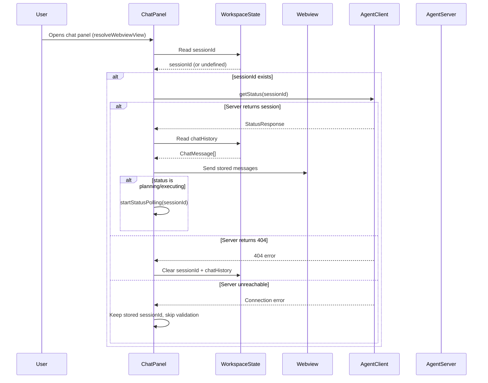
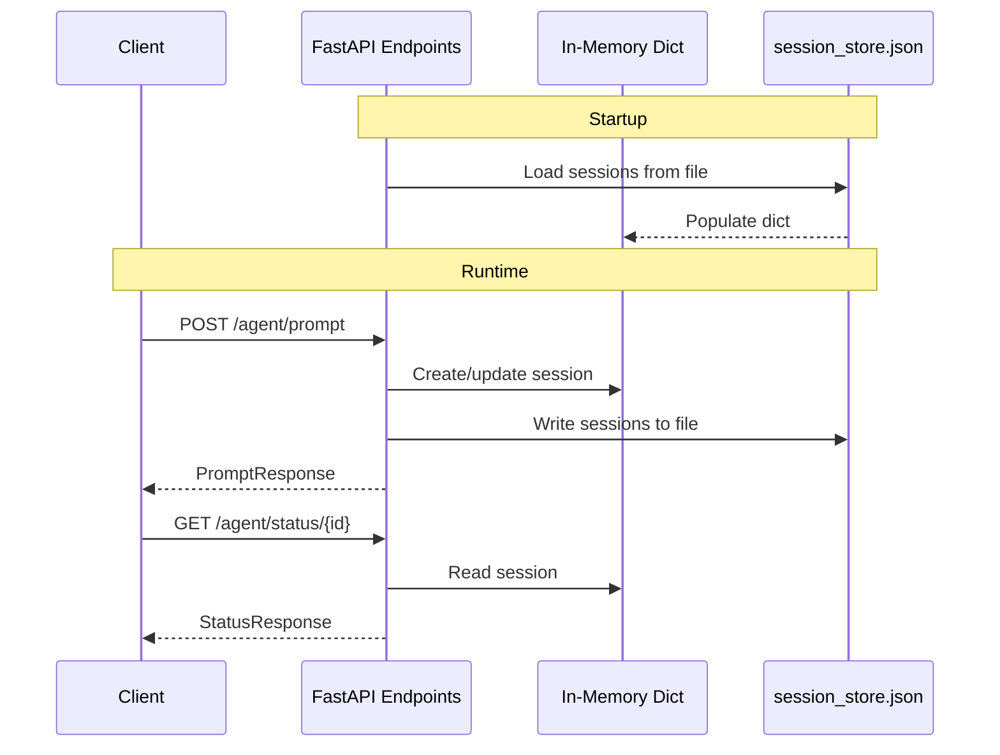

# Design Document: Session Persistence

## Overview

This feature adds session persistence across three layers:

1. **Extension host**: The `ChatPanel` persists the `sessionId` and chat history to `ExtensionContext.workspaceState`, which survives panel disposal and VS Code restarts.
2. **Webview**: The webview script uses `acquireVsCodeApi().setState()`/`getState()` to preserve rendered messages across visibility changes (tab switching).
3. **Server**: The `AgentSession` objects are serialized to a JSON file on disk, loaded on startup, and written on every state change.

On panel restore, the extension validates the stored session against the server. If the server confirms the session exists, the extension restores chat history and resumes polling if needed. If the server returns 404 (e.g., after restart without persistence, or session expired), the extension clears stored state and starts fresh.

## Architecture

### Session Restore Flow



### Server Persistence Flow



### Design Decisions

1. **`workspaceState` over `globalState`**: Sessions are workspace-specific (they reference a workspace path), so per-workspace storage is the correct scope. `globalState` would leak sessions across workspaces.

2. **Webview `setState`/`getState` for visibility changes**: VS Code preserves webview state across visibility changes automatically when `setState` is used. This is simpler and faster than re-sending messages from the extension host on every visibility toggle.

3. **JSON file for server persistence**: A single JSON file is the simplest approach that meets the requirement. SQLite would be more robust for concurrent access, but the agent server handles one session at a time and the file is small. JSON is human-readable and easy to debug.

4. **Validation before restore**: The extension validates the stored session against the server before restoring UI state. This prevents showing stale data from a session the server no longer knows about.

5. **Graceful degradation on unreachable server**: If the server is unreachable during validation, the extension keeps the stored sessionId and tries to use it later. This handles the case where the user opens VS Code before starting the server.

## Components and Interfaces

### Modified: `ChatPanel` (vscode-extension/src/chatPanel.ts)

The constructor gains an `ExtensionContext` parameter for accessing `workspaceState`.

```typescript
// New constructor signature
constructor(
    extensionUri: vscode.Uri,
    agentClient: AgentClient,
    context: vscode.ExtensionContext
)
```

New private methods:

```typescript
/**
 * Persist the current sessionId to workspaceState.
 */
private persistSessionId(sessionId: string | undefined): void

/**
 * Restore sessionId from workspaceState.
 */
private restoreSessionId(): string | undefined

/**
 * Append a message to the persisted chat history.
 */
private persistMessage(role: string, content: string): void

/**
 * Load chat history from workspaceState.
 */
private loadChatHistory(): Array<{ role: string; content: string }>

/**
 * Clear persisted chat history.
 */
private clearChatHistory(): void

/**
 * Validate a restored session against the server.
 * Returns the StatusResponse if valid, or null if the session is gone.
 */
private async validateSession(sessionId: string): Promise<StatusResponse | null>

/**
 * Restore the UI state from persisted data after panel resolve.
 */
private async restoreSession(): Promise<void>
```

Updated `resolveWebviewView`:

```typescript
public resolveWebviewView(
    webviewView: vscode.WebviewView,
    _context: vscode.WebviewViewResolveContext,
    _token: vscode.CancellationToken
): void {
    // ... existing setup ...
    // After setting up message handlers:
    void this.restoreSession();
}
```

Updated `sendMessage` — persists sessionId and messages:

```typescript
public async sendMessage(text: string): Promise<void> {
    this.addMessage('user', text);
    this.persistMessage('user', text);
    // ... existing logic ...
    this.sessionId = response.session_id;
    this.persistSessionId(response.session_id);
    // ... rest of method ...
}
```

Updated `addMessage` — also persists to workspaceState:

```typescript
public addMessage(role: 'user' | 'agent' | 'system', content: string): void {
    this.persistMessage(role, content);
    this.postMessageToWebview({ type: 'addMessage', role, content });
}
```

### Modified: Webview HTML/JS (inside `getHtmlForWebview`)

The webview script is updated to use `setState`/`getState` for message persistence across visibility changes.

```javascript
// On message received, save to state
case 'addMessage': {
    const div = document.createElement('div');
    // ... existing rendering ...
    // Save messages to webview state
    const state = vscode.getState() || { messages: [] };
    state.messages.push({ role: msg.role, content: msg.content });
    vscode.setState(state);
    break;
}

// On script init, restore from state
const previousState = vscode.getState();
if (previousState && previousState.messages) {
    previousState.messages.forEach(function(m) {
        const div = document.createElement('div');
        div.className = 'message ' + m.role;
        div.innerHTML = renderContent(m.content);
        messagesEl.appendChild(div);
    });
}
```

### Modified: `extension.ts` (vscode-extension/src/extension.ts)

Pass `ExtensionContext` to `ChatPanel` constructor:

```typescript
const chatPanel = new ChatPanel(context.extensionUri, agentClient, context);
```

### New: `SessionStore` (server/session_store.py)

A module responsible for serializing/deserializing `AgentSession` objects to/from a JSON file.

```python
"""Session persistence to JSON file."""
import json
import logging
from pathlib import Path
from typing import Dict, Optional
from datetime import datetime

from agent.models import (
    AgentSession, SessionStatus, Plan, Task, TaskStatus,
    TaskComplexity, ExecutionResult, FileChange, ChangeType
)

logger = logging.getLogger(__name__)


class SessionStore:
    """Persists AgentSession objects to a JSON file."""

    def __init__(self, store_path: str = "data/sessions.json"):
        self.store_path = Path(store_path)

    def save(self, sessions: Dict[str, AgentSession]) -> None:
        """Serialize all sessions to the JSON file."""

    def load(self) -> Dict[str, AgentSession]:
        """Deserialize sessions from the JSON file. Returns empty dict on error."""

    def serialize_session(self, session: AgentSession) -> dict:
        """Convert an AgentSession to a JSON-serializable dict."""

    def deserialize_session(self, data: dict) -> AgentSession:
        """Reconstruct an AgentSession from a dict."""
```

### Modified: `server/api.py`

- Import and instantiate `SessionStore` on startup
- Call `session_store.save(sessions)` after every session mutation (create, update status, apply changes, cancel)
- Call `session_store.load()` in `startup_event` to populate the `sessions` dict

```python
from server.session_store import SessionStore

session_store: Optional[SessionStore] = None

@app.on_event("startup")
async def startup_event():
    global session_store, sessions
    # ... existing init ...
    store_path = "data/sessions.json"
    if config:
        store_path = getattr(config.agent, 'session_store_path', store_path)
    session_store = SessionStore(store_path)
    sessions = session_store.load()
```

Helper to persist after mutations:

```python
def persist_sessions() -> None:
    """Write current sessions to disk."""
    if session_store:
        session_store.save(sessions)
```

Called at the end of `process_prompt`, `apply_changes`, `cancel_session`, and `notify_applied`.

## Data Models

### `ChatMessage` (new, extension-side)

```typescript
interface ChatMessage {
    role: 'user' | 'agent' | 'system';
    content: string;
}
```

Stored as an array in `workspaceState` under the key `"agent.chatHistory"`.

### `WebviewState` (new, webview-side)

```typescript
interface WebviewState {
    messages: Array<{ role: string; content: string }>;
}
```

Managed by `acquireVsCodeApi().setState()` / `getState()`.

### WorkspaceState Keys

| Key | Type | Description |
|-----|------|-------------|
| `agent.sessionId` | `string \| undefined` | Current session ID |
| `agent.chatHistory` | `ChatMessage[]` | Persisted chat messages |

### Session Store File Format (server-side)

```json
{
  "sessions": {
    "uuid-1": {
      "session_id": "uuid-1",
      "workspace_path": "/path/to/workspace",
      "status": "completed",
      "created_at": "2025-01-15T10:30:00",
      "updated_at": "2025-01-15T10:35:00",
      "error": null,
      "plan": {
        "plan_id": "plan-1",
        "tasks": [
          {
            "task_id": "task-1",
            "description": "Implement feature X",
            "dependencies": [],
            "estimated_complexity": "medium",
            "status": "completed"
          }
        ],
        "created_at": "2025-01-15T10:30:00"
      },
      "execution_result": {
        "plan_id": "plan-1",
        "status": "completed",
        "completed_tasks": ["task-1"],
        "failed_tasks": [],
        "all_changes": [
          {
            "change_id": "change-1",
            "file_path": "src/feature.py",
            "change_type": "create",
            "original_content": null,
            "new_content": "# new file content",
            "diff": "...",
            "applied": true
          }
        ]
      }
    }
  },
  "version": 1
}
```

## Correctness Properties

### Property 1: Session ID round-trip through workspaceState

*For any* valid session ID string, persisting it to workspaceState and then restoring it SHALL produce the same string. That is, `restoreSessionId() === sessionId` after `persistSessionId(sessionId)`.

**Validates: Requirements 1.1, 1.2**

### Property 2: Chat history append preserves order and content

*For any* sequence of N messages with roles and content, after appending each to workspaceState, `loadChatHistory()` SHALL return exactly N messages in the same order with identical role and content fields.

**Validates: Requirements 3.1, 3.2, 3.3**

### Property 3: Webview state round-trip

*For any* array of messages stored via `setState({ messages })`, calling `getState().messages` SHALL return an array with the same length, roles, and content. This is the webview-side round-trip property.

**Validates: Requirements 4.1, 4.2, 4.3**

### Property 4: Server session serialization round-trip

*For any* valid `AgentSession` object (with optional Plan, ExecutionResult, and FileChanges), `deserialize_session(serialize_session(session))` SHALL produce an AgentSession with equivalent field values.

**Validates: Requirements 5.1, 5.2, 5.3**

### Property 5: Session ID persistence is idempotent

*For any* session ID, calling `persistSessionId(id)` multiple times SHALL result in the same stored value as calling it once. `restoreSessionId()` returns the same value regardless of how many times it was persisted.

**Validates: Requirements 1.1**

### Property 6: Chat history clear produces empty state

*For any* non-empty chat history in workspaceState, calling `clearChatHistory()` SHALL result in `loadChatHistory()` returning an empty array.

**Validates: Requirements 3.4**

### Property 7: Corrupt session file produces empty sessions

*For any* non-JSON string written to the session store file path, `SessionStore.load()` SHALL return an empty dictionary and not raise an exception.

**Validates: Requirements 5.4**

### Property 8: Session resume preserves session state

*For any* AgentSession that has been persisted to the store, when the server restarts and loads from the store, a `GET /agent/status/{session_id}` request SHALL return the same status, completed_tasks, and pending_changes as before the restart.

**Validates: Requirements 6.1, 6.2**

## Error Handling

### Extension: Server Unreachable During Validation

- `validateSession` catches connection errors (ECONNREFUSED, ETIMEDOUT) and returns `null` without clearing stored state.
- The stored sessionId is kept so it can be used when the server becomes available.
- Chat history is still restored from workspaceState (it's local data, independent of server).

### Extension: Server Returns 404 for Stored Session

- `validateSession` detects 404 responses and returns `null`.
- The extension clears both `agent.sessionId` and `agent.chatHistory` from workspaceState.
- The webview state is also cleared by sending a `clearMessages` command.
- The user sees a fresh chat panel.

### Extension: workspaceState Contains Invalid Data

- `restoreSessionId` returns `undefined` if the stored value is not a string.
- `loadChatHistory` returns an empty array if the stored value is not a valid array.
- No error is shown to the user; the extension silently starts fresh.

### Server: Corrupt Session Store File

- `SessionStore.load()` wraps JSON parsing in a try/except.
- On `json.JSONDecodeError` or `KeyError`, logs a warning and returns an empty dict.
- The server starts normally with no sessions.
- The corrupt file is not deleted — it's left for manual inspection.

### Server: File Write Failures

- `SessionStore.save()` wraps file writing in a try/except.
- On `IOError` or `OSError`, logs an error but does not crash the server.
- The in-memory sessions remain correct; only persistence is affected.
- The `data/` directory is created automatically if it doesn't exist (using `Path.mkdir(parents=True, exist_ok=True)`).

## Testing Strategy

### Testing Framework

- **Extension unit tests**: Jest (existing in `vscode-extension/jest.config.js`)
- **Extension property tests**: fast-check (existing in `devDependencies`)
- **Server unit tests**: pytest (existing in `tests/`)
- **Server property tests**: hypothesis (existing in requirements)
- **Mocking**: Jest mocks with `__mocks__/vscode.ts` for extension; pytest fixtures for server

### Extension Unit Tests

File: `vscode-extension/src/__tests__/chatPanel.persistence.test.ts`

1. **Session restore with valid server session**: Mock getStatus to return a valid response. Verify chat history is sent to webview and polling starts for active sessions.
2. **Session restore with 404**: Mock getStatus to throw 404. Verify sessionId and chatHistory are cleared from workspaceState.
3. **Session restore with unreachable server**: Mock getStatus to throw ECONNREFUSED. Verify sessionId is retained in workspaceState.
4. **New message persists sessionId**: Call sendMessage, verify workspaceState.update is called with the returned sessionId.
5. **New message appends to chat history**: Call addMessage, verify the message is appended to the stored array.
6. **Clear history on new session**: Verify clearChatHistory is called when no sessionId is stored and a new message is sent.
7. **No polling for completed sessions**: Restore a session with status "completed", verify startStatusPolling is not called.

### Extension Property Tests

File: `vscode-extension/src/__tests__/chatPanel.property.test.ts`

Custom arbitraries:
- `sessionIdArb`: `fc.uuid()` — generates valid UUID strings
- `chatMessageArb`: `fc.record({ role: fc.constantFrom('user', 'agent', 'system'), content: fc.string({ minLength: 1 }) })`
- `chatHistoryArb`: `fc.array(chatMessageArb, { minLength: 0, maxLength: 50 })`

Property tests (100 runs minimum each):
1. **Property 1**: Session ID round-trip through workspaceState
2. **Property 2**: Chat history append preserves order and content
3. **Property 3**: Webview state round-trip
4. **Property 5**: Session ID persistence is idempotent
5. **Property 6**: Chat history clear produces empty state

### Server Unit Tests

File: `tests/test_session_store.py`

1. **Save and load sessions**: Create sessions, save, load, verify equality.
2. **Load from nonexistent file**: Verify empty dict returned.
3. **Load from corrupt file**: Write garbage to file, verify empty dict returned and warning logged.
4. **Save creates data directory**: Remove data dir, save, verify dir created.
5. **Integration with API**: Start server, create session via prompt, restart, verify session accessible via status endpoint.

### Server Property Tests

File: `tests/test_session_store_property.py`

Custom strategies:
- `session_status_st`: `st.sampled_from(SessionStatus)`
- `task_st`: Builds `Task` with random fields
- `plan_st`: Builds `Plan` with list of tasks
- `file_change_st`: Builds `FileChange` with random fields
- `execution_result_st`: Builds `ExecutionResult` with random fields
- `agent_session_st`: Builds `AgentSession` with optional plan and execution result

Property tests (100 runs minimum each):
1. **Property 4**: Server session serialization round-trip
2. **Property 7**: Corrupt session file produces empty sessions
3. **Property 8**: Session resume preserves session state (via serialize/deserialize + status extraction)

### Test Configuration

- fast-check `numRuns`: 100 (minimum per property)
- hypothesis `max_examples`: 100 (minimum per property)
- Jest test environment: `node` (existing config)
- Mock `workspaceState` as a simple `Map`-backed object with `get`/`update` methods in `__mocks__/vscode.ts`
