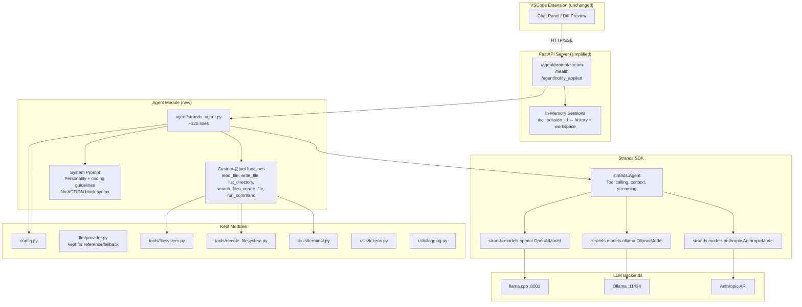
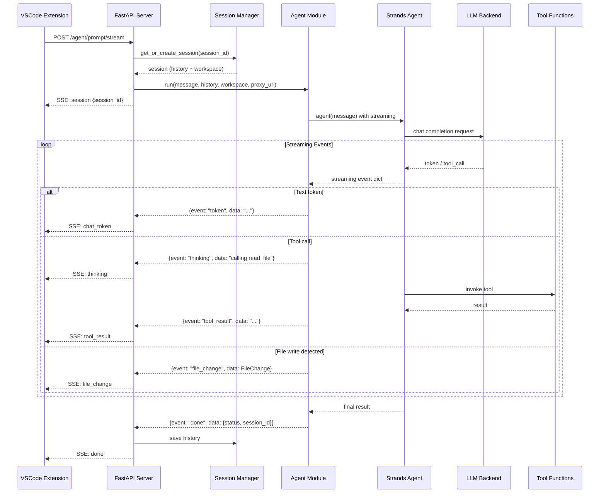

# Design Document: Strands Agent Migration

## Overview

This design replaces Byte Beaver's custom ReAct agent loop (~1150 lines of hand-rolled ACTION block parsing, context budget management, conversation summarization, and SQLite session persistence) with the Strands Agents SDK. The SDK provides native tool calling, context management, and streaming out of the box, eliminating the root cause of complexity: fighting the LLM's natural tool-calling format with a custom text-based protocol.

The migration preserves the existing VSCode extension, FastAPI server shell, multi-model support (llama.cpp, Ollama, Anthropic), and remote desktop workflow. The Python backend shrinks from ~19 files / ~5000 lines to ~11 files / ~1500 lines.

### Key Design Decisions

1. **Strands SDK over raw function calling**: The SDK handles the agent loop, tool dispatch, streaming, and context management. We avoid reimplementing these.
2. **Custom `@tool` wrappers over `strands_tools` builtins**: The built-in `file_read`, `file_write`, `shell` tools from `strands-agents-tools` operate on the local filesystem. For the remote desktop workflow, we need tools that can delegate to the VSCode file proxy. Custom `@tool`-decorated functions let us inject this routing logic.
3. **In-memory sessions over SQLite**: The old `SessionStore` added complexity for a feature (cross-restart persistence) that isn't critical. Simple dict-based sessions are sufficient. Strands Agent instances manage their own conversation state.
4. **Event translation layer**: Strands emits its own streaming event format (dicts with `data`, `current_tool_use`, `result` keys). We translate these to the SSE event format the VSCode extension already consumes (`session`, `thinking`, `tool_result`, `chat_token`, `file_change`, `done`, `error`).

## Architecture



### Request Flow



## Components and Interfaces

### 1. Agent Module (`agent/strands_agent.py`)

The central new module. A thin wrapper (~120 lines) that:
- Creates a Strands `Agent` from the existing `Config` object
- Registers custom `@tool` functions that route through local or remote filesystem
- Translates Strands streaming events to SSE-compatible event dicts
- Handles errors gracefully

```python
# Public interface
class StrandsAgentWrapper:
    def __init__(self, config: Config, workspace_path: str,
                 file_proxy_url: Optional[str] = None):
        """Initialize Strands Agent from config."""
        ...

    def run(self, message: str,
            conversation_history: Optional[List[Dict[str, str]]] = None
            ) -> Iterator[Dict[str, Any]]:
        """Yield SSE-compatible event dicts."""
        ...
```

**Model provider mapping:**

| Config `llm.provider` | Strands Model Class | Key Config |
|---|---|---|
| `openai_compatible`, `llamacpp`, `vllm` | `OpenAIModel` | `client_args={"base_url": config.llm.base_url}`, `model_id=config.llm.model` |
| `ollama` | `OllamaModel` | `host=config.llm.base_url`, `model_id=config.llm.model` |
| `anthropic` | `AnthropicModel` | `model_id=config.llm.model`, API key from config or env |

**Event translation mapping:**

| Strands Event Key | SSE Event Type | Payload |
|---|---|---|
| `data` (text chunk) | `chat_token` | `{"token": text}` |
| `current_tool_use` (with name) | `thinking` | `{"message": "Calling {tool_name}"}` |
| `current_tool_use` (tool result in next event) | `tool_result` | `{"result": result_text}` |
| File write detected in tool result | `file_change` | `{"change_id", "file_path", "change_type", "diff"}` |
| `result` (final) | `done` | `{"status": "completed", "session_id": id}` |
| Exception caught | `error` | `{"error": error_message}` |

### 2. Custom Tool Functions

Instead of using `strands_tools` builtins directly, we define custom `@tool`-decorated functions that route through our existing `FilesystemTools` / `RemoteFilesystemTools` / `TerminalTools`. This preserves:
- Path sandboxing (workspace boundary enforcement)
- Remote file proxy support
- Security checks on terminal commands

```python
from strands import tool

def create_tools(workspace_path: str, file_proxy_url: Optional[str] = None):
    """Create tool functions bound to a specific workspace."""

    if file_proxy_url:
        fs = RemoteFilesystemTools(file_proxy_url)
    else:
        fs = FilesystemTools(workspace_path)
    terminal = TerminalTools(workspace_path)

    @tool
    def read_file(path: str) -> str:
        """Read file contents. Path is relative to workspace root."""
        return fs.read_file(path)

    @tool
    def write_file(path: str, contents: str) -> str:
        """Write contents to a file. Creates parent dirs if needed."""
        fs.write_file(path, contents)
        return f"Written to {path}"

    @tool
    def create_file(path: str) -> str:
        """Create an empty file."""
        fs.create_file(path)
        return f"Created {path}"

    @tool
    def list_directory(path: str = ".") -> str:
        """List directory contents. Use '.' for workspace root."""
        entries = fs.list_directory(path)
        return "\n".join(entries)

    @tool
    def search_files(query: str) -> str:
        """Search for files matching a glob pattern."""
        results = fs.search_files(query)
        return "\n".join(results) if results else "No files found"

    @tool
    def run_command(command: str) -> str:
        """Run a shell command in the workspace."""
        result = terminal.run_command(command)
        return json.dumps({
            "exit_code": result.exit_code,
            "stdout": result.stdout,
            "stderr": result.stderr,
        })

    return [read_file, write_file, create_file,
            list_directory, search_files, run_command]
```

### 3. Simplified FastAPI Server (`server/api.py`)

Reduced from ~980 lines to ~200 lines. Three endpoints:

**`POST /agent/prompt/stream`** — Main endpoint. Accepts `PromptRequest`, creates/retrieves session, invokes `StrandsAgentWrapper.run()`, streams SSE events.

**`GET /health`** — Returns server status and LLM connectivity. Simplified to check if the Strands model can be instantiated.

**`POST /agent/notify_applied`** — Accepts session ID + change IDs. Marks file changes as applied in the session's change list. Kept for the VSCode extension's apply/reject flow.

**Removed endpoints:**
- `POST /agent/prompt` (non-streaming) — extension only uses streaming
- `GET /agent/status/{session_id}` — was for the old planner system
- `POST /agent/apply_changes` — server-side file writing; extension applies changes client-side
- `GET /health/detailed` — unnecessary granularity
- `GET /metrics` — metrics system is being removed

**Session management:**
```python
# Simple in-memory sessions
sessions: Dict[str, dict] = {}
# Each session: {"workspace_path": str, "history": List[Dict], "changes": List[FileChange]}
```

### 4. Simplified Data Models (`agent/models.py`)

Reduced from ~130 lines to ~30 lines. Only two items remain:

```python
class ChangeType(str, Enum):
    CREATE = "create"
    MODIFY = "modify"
    DELETE = "delete"

@dataclass
class FileChange:
    change_id: str
    file_path: str
    change_type: ChangeType
    original_content: Optional[str] = None
    new_content: Optional[str] = None
    diff: str = ""
    applied: bool = False
```

**Removed:** `Task`, `Plan`, `ExecutionResult`, `TaskResult`, `TaskStatus`, `TaskComplexity`, `AgentSession`, `ToolCall`, `SessionStatus`.

### 5. Simplified Config (`config.py`)

Remove `ContextConfig`, `VectorDBConfig`, `WebSearchConfig`, `PerformanceConfig`. The `ToolConfig` retains only `terminal` and `filesystem`. The `Config.load()` method no longer requires `context`, `tools.web_search`, or `performance` sections.

### 6. System Prompt

The new system prompt focuses on personality and coding guidance. It removes all ACTION block syntax instructions since Strands handles tool-calling format natively via the model's function-calling protocol.

**Retained:**
- ByteBeaver personality (concise senior dev)
- Planning-before-coding guidance for complex tasks
- Error-fixing rules (read file first, targeted changes, explain the fix)
- Code generation rules (use tools to write files, create requirements.txt)

**Removed:**
- ACTION block format instructions
- WRITE_FILE / PATCH_FILE directive syntax
- Tool description list (Strands provides this automatically from `@tool` docstrings)
- JSON escaping instructions

## Data Models

### FileChange (retained)

| Field | Type | Description |
|---|---|---|
| `change_id` | `str` | UUID identifying this change |
| `file_path` | `str` | Path relative to workspace root |
| `change_type` | `ChangeType` | CREATE, MODIFY, or DELETE |
| `original_content` | `Optional[str]` | Content before change (for diffs) |
| `new_content` | `Optional[str]` | Content after change |
| `diff` | `str` | Unified diff string |
| `applied` | `bool` | Whether the change has been applied |

### Session (new, simple dict)

| Field | Type | Description |
|---|---|---|
| `workspace_path` | `str` | Workspace root path |
| `history` | `List[Dict[str, str]]` | Conversation messages `[{"role": "user", "content": "..."}]` |
| `changes` | `List[FileChange]` | Proposed file changes from agent |

### SSE Event (output format)

| Field | Type | Description |
|---|---|---|
| `event` | `str` | Event type: session, thinking, tool_result, chat_token, file_change, done, error |
| `data` | `dict` | Event-specific payload (JSON-serialized in SSE) |

## Correctness Properties

*A property is a characteristic or behavior that should hold true across all valid executions of a system — essentially, a formal statement about what the system should do. Properties serve as the bridge between human-readable specifications and machine-verifiable correctness guarantees.*

### Property 1: Config-to-model provider mapping

*For any* valid configuration with a recognized `llm.provider` value (one of `openai_compatible`, `llamacpp`, `vllm`, `ollama`, `anthropic`), the Agent Module SHALL create a Strands model instance of the correct type with the configured base URL, model name, and generation parameters matching the input config.

**Validates: Requirements 2.1, 2.2, 2.3, 2.4**

### Property 2: Strands event to SSE event translation

*For any* Strands streaming event dictionary, the Agent Module's event translation layer SHALL produce an SSE-compatible event dictionary with the correct event type (`thinking`, `tool_result`, `chat_token`, `file_change`, or `done`) and a payload containing all required fields for that event type.

**Validates: Requirements 2.6, 4.5, 9.2, 9.3, 9.4, 9.5**

### Property 3: Proxy-aware tool routing

*For any* workspace configuration, when a `file_proxy_url` is provided, all file operation tools (read_file, write_file, create_file, list_directory, search_files) SHALL delegate to `RemoteFilesystemTools`, while `run_command` SHALL always use local `TerminalTools` regardless of proxy configuration.

**Validates: Requirements 3.1, 3.3**

### Property 4: Session data round-trip

*For any* session ID and workspace path, creating a session and then retrieving it SHALL return a session with the same workspace path and conversation history. Adding messages to a session and retrieving it SHALL preserve all messages in order.

**Validates: Requirements 4.4, 4.6**

### Property 5: Config loading resilience

*For any* valid YAML configuration containing the `llm` and `agent` sections with correct field types, and a `tools` section with `terminal` and `filesystem` subsections, `Config.load()` SHALL succeed without raising validation errors, regardless of whether the `context`, `tools.web_search`, or `performance` sections are present.

**Validates: Requirements 7.1, 7.2, 7.3, 7.4, 7.5, 7.6**

## Error Handling

### Agent Module Errors

| Error Scenario | Handling |
|---|---|
| LLM connection failure | Yield `{"event": "error", "data": {"error": "LLM unreachable: ..."}}`. Do not crash the generator. |
| Tool execution failure | Strands SDK feeds the error back to the LLM for self-correction. If the tool raises `ProxyUnavailableError`, the error message tells the LLM the proxy is down. |
| Strands Agent exception | Catch in the `run()` generator, yield an error event, then return. |
| Invalid config provider | Raise `ValueError` at initialization time with a descriptive message listing valid providers. |

### Server Errors

| Error Scenario | Handling |
|---|---|
| LLM not initialized | Return HTTP 503 with `"LLM client not initialized. Check server logs."` |
| Invalid request (bad prompt, missing fields) | Pydantic validation returns HTTP 422 with field-level errors. |
| Session not found (for notify_applied) | Return HTTP 404 with `"Session not found"`. |
| Streaming error mid-response | Emit SSE `error` event with the exception message, then close the stream. |

### File Proxy Errors

| Error Scenario | Handling |
|---|---|
| Proxy unreachable | `RemoteFilesystemTools` raises `ProxyUnavailableError`. The `@tool` function catches it and returns an error string to the Strands Agent, which can inform the user. |
| Proxy returns non-200 | Raise `FileNotFoundError` or `RuntimeError` with the proxy's error message. |

## Testing Strategy

### Property-Based Tests (Hypothesis)

Property-based testing is appropriate for this feature because the core logic involves mapping between data structures (config → model, Strands events → SSE events, session operations) where behavior varies meaningfully with input and universal properties should hold.

- **Library**: `hypothesis` (already in the project)
- **Minimum iterations**: 100 per property test
- **Tag format**: `Feature: strands-agent-migration, Property {N}: {title}`

Each correctness property maps to a single property-based test:

1. **Config-to-model mapping**: Generate random valid `Config` objects with different provider types. Verify the correct Strands model class is instantiated with matching parameters.
2. **Event translation**: Generate random Strands event dicts (with `data`, `current_tool_use`, `result` keys). Verify each translates to the correct SSE event type with complete payload.
3. **Proxy-aware tool routing**: Generate random workspace paths and optional proxy URLs. Verify file tools use the correct filesystem implementation and terminal always uses local.
4. **Session round-trip**: Generate random session IDs, workspace paths, and message sequences. Verify create → add messages → retrieve preserves all data.
5. **Config loading resilience**: Generate random valid YAML config dicts with only the retained sections. Verify `Config.load()` succeeds.

### Unit Tests (pytest)

Focus on specific examples and edge cases not covered by property tests:

- **Spike validation**: Manual integration tests against each LLM backend (Req 1.1–1.5)
- **Tool registration**: Verify all 6 tools are registered with the Strands Agent (Req 2.5)
- **Error event on exception**: Mock Strands Agent to raise, verify error event (Req 2.7)
- **Proxy connectivity failure**: Mock unreachable proxy, verify graceful error (Req 3.2)
- **Endpoint existence**: Verify `/agent/prompt/stream`, `/health`, `/agent/notify_applied` exist (Req 4.1–4.3)
- **HTTP 503 when LLM missing**: Verify 503 response when LLM is None (Req 4.7)
- **FileChange and ChangeType structure**: Verify fields and enum values (Req 5.1, 5.2)
- **Dead code removal**: Verify deleted files don't exist and no imports reference them (Req 8.1–8.9)
- **System prompt content**: Verify personality, no ACTION blocks, planning guidance, error-fixing rules (Req 10.1–10.4)
- **SSE event sequence**: Verify session event first, done event last (Req 9.1, 9.6)
- **Dependency checks**: Verify requirements.txt has correct packages (Req 6.1–6.4)

### Integration Tests

Manual test matrix against live LLM backends:

| Prompt | llama.cpp | Ollama | Anthropic |
|---|---|---|---|
| "Hello" (chat) | ☐ | ☐ | ☐ |
| "Read main.py" (tool use) | ☐ | ☐ | ☐ |
| "Create a snake game" (file creation) | ☐ | ☐ | ☐ |
| "Fix this error: ..." (debug) | ☐ | ☐ | ☐ |
| Remote workspace via proxy | ☐ | ☐ | ☐ |
